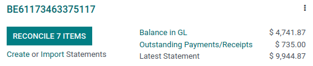
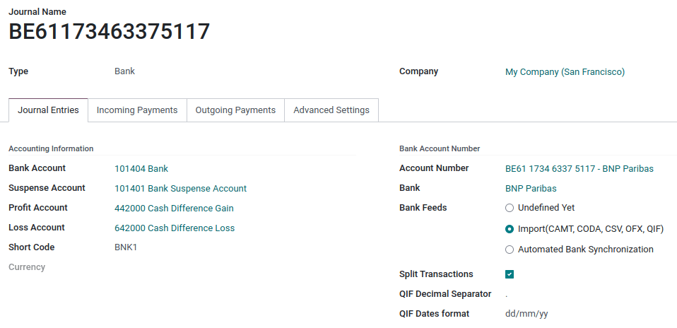
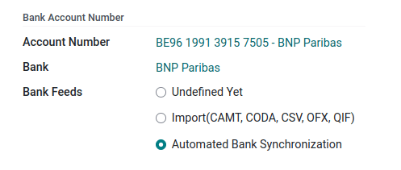

=============
Bank accounts
=============

You can manage as many bank accounts as needed on your database. Configuring them well allows you to
have all your banking data up-to-date and ready for :doc:`reconciliation
<../../bank/reconciliation/use_cases>` with your journal entries.

In Odoo Accounting, each bank account has a dedicated journal set to post all entries in a dedicated
account. Both the journal and the account are automatically created and configured whenever you add
a bank account.

Bank journals are displayed by default on the :guilabel:`Accounting Dashboard` in the form of cards
which include action buttons.

.. _bank_accounts_add:

Add a bank account
==================

You have two options to add a bank account:

- Connect it to your database to synchronize your bank statements automatically.
- Create it and :doc:`upload your bank statements manually <../feeds/bank_statements>`.

Connect your bank for automatic synchronization
-----------------------------------------------

To connect your bank account to your database, go to :menuselection:`Accounting --> Configuration
--> Banks: Add a Bank Account`. Select your bank in the list, click on :guilabel:`Connect`, and
follow the instructions.

.. seealso::
   :doc:`../../bank/feeds/bank_synchronization`

Create a bank account
---------------------

If your banking institution is not available in Odoo, or if you don't want to connect your bank
account to your database, you can configure your bank account manually.

A default bank journal is available and can be used to configure your bank account by going to
:menuselection:`Accounting --> Configuration --> Accounting: Journals --> Bank`. Open it and edit
the different fields to match your bank account information.

To manually add another bank account, go to :menuselection:`Accounting --> Configuration --> Banks:
Add a Bank Account`, click on :guilabel:`Create it` (at the bottom right), and fill out the form.

.. note::
   Odoo automatically detects the bank account type (e.g., IBAN) and enables some features
   accordingly.

.. _bank_accounts_configuration:

Edit an existing bank account
=============================

To edit an existing bank account, go to :menuselection:`Accounting --> Configuration --> Accounting:
Journals` and select the bank journal you want to modify.

If you need to **edit your bank account details**, click on your :guilabel:`Account Number`. On the
new page, click on your :guilabel:`Bank` and update your bank information accordingly. These details
are used when registering payments.

:guilabel:`Bank Feeds` can be selected from the bank journal to define how your bank statements are
registered. Three options are available:

- :guilabel:`Undefined yet`, which should be selected when you don’t know yet if you will
  synchronize your bank account with your database or not.
- :guilabel:`Import (CAMT, CODA, CSV, OFX, QIF)`, which should be selected if you want to import
  your bank statement using a different format.
- :guilabel:`Automated Bank Synchronization`, which should be selected if your bank is synchronized
  with your database.
