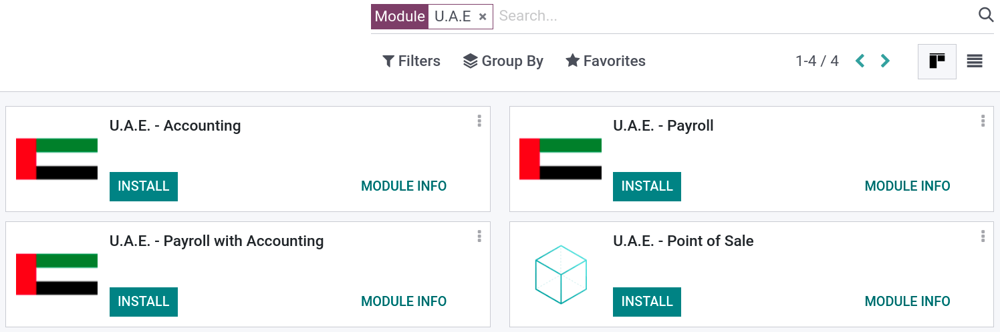

====================
United Arab Emirates
====================

.. _uae/installation:

Installation
============

According to your needs, :ref:`install <general/install>` the following modules to get all the
features of the **United Arab Emirates** localization:

.. list-table::
   :header-rows: 1

   * - Name
     - Technical name
     - Description
   * - :guilabel:`U.A.E. - Accounting`
     - ``l10n_ae``
     - Default :doc:`fiscal localization package <../overview/fiscal_localization_packages>`.
       Contains all accounts, taxes, and reports.
   * - :guilabel:`U.A.E. - Payroll`
     - ``l10n_ae_hr_payroll``
     - Contains all rules, calculations, and salary structures.
   * - :guilabel:`U.A.E. - Payroll with Accounting`
     - ``l10n_ae_hr_payroll_account``
     - Contains all rules, calculations, salary structures, and accounts related to the rules.
   * - :guilabel:`U.A.E. - Point of Sale`
     - ``l10n_ae_pos``
     - Contains the U.A.E-compliant PoS receipt.

.. example::
   If you only use the **Accounting** and **Point of Sale** apps, then only select these modules.

Configuration (this part is to be changed into a seealso or something)
======================================================================

Go to :menuselection:`Accounting --> Configuration --> Settings`, and double-check if the
package is set up in place.

An updated set of accounts is installed within the package. A mix of services-retail applicable
accounts, as well as legal/regulatory [VAT] accounts.

Configuration
=============

Chart of accounts
-----------------

Go to :menuselection:`Accounting --> Configuration --> Chart of Accounts` to view all default
accounts available for your localization package. You can filter either by :guilabel:`code` using
the numbers on the far left, or by clicking on :guilabel:`Group By` and selecting :guilabel:`Account
Type`. From this menu, you can **activate, deactivate, or configure** specific accounts according to
your needs.

Make sure to always keep at least one **Receivable Account** and one **Payable Account** active.
Additionally, we also advise to keep the accounts below active, as they are either used as
transitory accounts by Odoo or are specific to the U.A.E localization package.

.. list-table::
   :header-rows: 1

   * - Code
     - Account Name
     - Type
   * - 102011
     - Accounts Receivable
     - Receivable
   * - 102012
     - Accounts Receivable (PoS)
     - Receivable
   * - 201002
     - Payables
     - Payable
   * - 101004
     - Bank
     - Bank and Cash
   * - 105001
     - Cash
     - Bank and Cash
   * - 100001
     - Liquidity Transfer
     - Current Assets
   * - 101002
     - Outstanding Receipts
     - Current Assets
   * - 101003
     - Oustanding Payments
     - Current Assets
   * - 104041
     - VAT Input
     - Current Assets
   * - 100103
     - VAT Receivable
     - Non-current Assets
   * - 101001
     - Bank Suspense Account
     - Current Liabilities
   * - 201017
     - VAT Output
     - Current Liabilities
   * - 202001
     - End of Service Provision
     - Current Liabilities
   * - 202003
     - VAT Payable
     - Non-current Liabilities
   * - 999999
     - Undistributed Profits/Losses
     - Current Year Earnings
   * - 400003
     - Basic Salary
     - Expenses
   * - 400004
     - Housing Allowance
     - Expenses
   * - 400005
     - Transportation Allowance
     - Expenses
   * - 400008
     - End of Service Indemnity
     - Expenses

Taxes and tax report
---------------------

Taxes
~~~~~

To access your taxes, head to :menuselection:`Accounting --> Configuration --> Taxes`. From here,
activate, deactivate, or :doc:`configure the taxes
<../../../accounting/taxation/taxes/taxes>` relevant to your business by clicking on them. Remember
to only set accounts on the **5%** tax group, as other groups do not need closing.

.. tip::
   Use the :guilabel:`Group By --> Tax Type` filter to group taxes by type and have a clear overview
   of the different taxes.

.. image:: united_arab_emirates/uae-localization-taxes.png
   :align: center
   :alt: Preview of the U.A.E. localization package's taxes.

Tax report
~~~~~~~~~~

To create a tax report when closing your period, head to :menuselection:`Accounting --> Reporting
--> Tax Report`. The closing period corresponds to the period configured in
:menuselection:`Accounting --> Configuration --> Settings --> Taxes`, but you can always change it
by clicking on the **calendar icon** and selecting the period you wish to close.

Journals
--------
To configure your journals, go to :menuselection:`Accounting --> Configuration --> Journals`. You
can modify the pre-configured journals according to your needs, or create new journals with 5
possible types: **Sales, Purchase, Bank, Cash**, and **Miscellaneous**.

Currency exchange rates
-----------------------
Currency exchange rates are automatically updated from the U.A.E Central Bank, but by default the
interval is set to *manual*. If you wish to use the automated currency rate update, change the
interval to your desired frequency under :menuselection:`Accounting --> Configuration --> Settings
--> Currencies`.

It is also possible to use web services other than the **U.A.E Central Bank**, such as **xe.com** or
the **European Central Bank**. To do so, simply click on the drop-down menu of the
:guilabel:`Service` field and select one of the services.

.. _uae/payroll:

Payroll
=======

The :guilabel:`U.A.E. - Payroll` module includes all the rules configured under the
:guilabel:`U.A.E. Employee Payroll Structure` in the **Salary Rules** section as per the U.A.E.
rules and regulations. These rules are linked to their corresponding accounts found in the **Chart
of Accounts**.

.. image:: united_arab_emirates/uae-localization-salary-rules.png
   :align: center
   :alt: The U.A.E. Employee Payroll Structure.

Salary rules
------------

To apply these rules to an employee's contract, go to :menuselection:`Payroll --> Contracts -->
Contracts` and select the contract of the employee. In the :guilabel:`Salary Structure Type` field,
select :guilabel:`UAE Employee`.

.. image:: united_arab_emirates/uae-localization-salary-structure.png
   :align: center
   :alt: Select the Salary Structure Type to apply to the contract.

Leave deduction is calculated using a salary rule linked to the unpaid leave time off type, however, any other deduction or reimbursement is done manually using other inputs.

Additionally, overtime is added manually through work entries and finally, Generated from the Salary Attachments Model are the Attachment of Salary, Assignment of Salary, and Child Support.

.. tip::
   If you do not wish a rule to appear on a paycheck. go to :menuselection:`Payroll -->
   Configuration --> Structures`. Click on the **U.A.E. structure**, select the rule to hide, and
   uncheck :guilabel:`Appears on Payslip`.

Also if you go to any contract, under the Salary Information tab, you can find some fields that appear after installing the localization package such as Wage, Housing allowance, Transportation allowance, and Other allowances as well as the Number of days field which is how the end of service provision is calculated:

End of Service Provision
------------------------

The provision is defined as the total monthly allowance *divided* by 30, and then *multiplied* by
the number of days set in the field :guilabel:`Number of days` at the bottom of a contract's form.

The provision is then calculated via a salary rule associated with two accounts: the **End Of
Service Indemnity (Expense account)** and the **End of Service Provision (Non-current Liabilities
account)**. The latter is used to pay off the **End of service** amount by settling it with the
**Payables account**.

.. note::
   The **End of service** calculations are based on the gross salary according to the United Arab
   Emirates' HR laws. The start and end dates of the employee’s contracts trigger the calculations.

Invoices
--------
Invoices generated with the U.A.E localization installed can be in English, Arabic, or both. The
localization also includes a line to display the **VAT amount** per line.