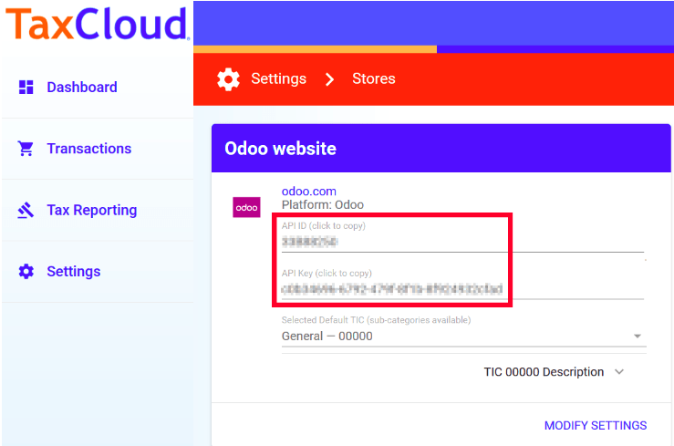
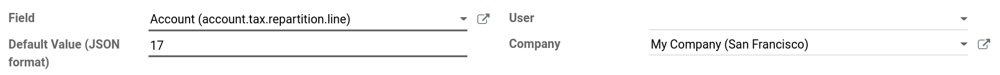

========================
Tax rates using TaxCloud
========================

The **TaxCloud** integration allows you to correctly calculate the sales tax for every address in
the United States and keeps track of which products are exempt from sales tax and in which states
each exemption applies. TaxCloud calculates sales tax in real-time for every state, city, and
special jurisdiction in the United States.

Configuration
=============

In TaxCloud
-----------
#. Create a free account on `TaxCloud <https://taxcloud.com/#register>`__ website.
#. Register your Odoo website on TaxCloud to get an **API ID** and an **API Key**.
#. In :guilabel:`Settings` on TaxCloud, click :guilabel:`Locations` to enter the location of your
   Office(s) and Warehouse(s).
#. In :guilabel:`Settings` on TaxCloud, click :guilabel:`Manage Tax States` to verify the states
   in which you collect sales tax.

In Odoo
-------
#. Go to :menuselection:`Accounting Dashboard --> Configuration --> Settings` and check
   :guilabel:`TaxCloud`
#. Enter your TaxCloud credentials.
#. Click :guilabel:`Save` to store your credentials.
#. Click the :guilabel:`Refresh` icon next to :guilabel:`Default Category` to import the **TIC**
   product categories from TaxCloud *(Taxability Information Codes)*. Some categories may imply
   specific rates or attract product/service type exemptions.
#. Select your default **TIC Code**. This will apply to any new product created.
#. Set a specific TaxCloud **TIC Category** on the :guilabel:`General Information` tab of the
   Product, or on the Product Category.
#. Make sure your company address is complete (including the state and the zip code). Go to
   :menuselection:`Settings --> General Settings --> Companies` to open and edit your company
   record.

.. image:: taxcloud/taxcloud02.png
  :align: center
  :alt: Enter your TaxCloud credentials.

Automatically post taxes in the correct Tax Payable account
~~~~~~~~~~~~~~~~~~~~~~~~~~~~~~~~~~~~~~~~~~~~~~~~~~~~~~~~~~~

* For each one of your companies that uses TaxCloud, it might be necessary to create a 
  **User-Defined Default** so that the new taxes generated by the TaxCloud integration are created 
  with the correct **Tax Payable** account:
  
.. warning::
   A User-Defined Default impacts all records at creation.  It means that **every** new tax will be 
   set up to record income in the specified Tax Payable account, unless the tax is manually edited
   to specify a different income account (or there exists another User-Defined Default that takes 
   precedence).

* In :menuselection:`Accounting Dashboard --> Configuration --> Chart of Accounts`, select the Tax
  Payable account for the company. Take note of the account's ``id`` in the URL string.

.. image:: taxcloud/user-default-find-account-id.png
   :align: center
   :alt: The account's ID can be found in the URL string as 'id=...'.

* Activate the :ref:`developer mode <developer-mode>`, then go to 
  :menuselection:`Settings App --> Technical --> Actions: User-Defined Defaults`, and click on
  :guilabel:`Create`.

* Click on :guilabel:`Field`, then, in the drop-down menu, on :guilabel:`Search More`.

.. image:: taxcloud/user-default-search-field.png
   :alt: Click on 'Search More' in the 'Field' drop-down menu. 
   :align: center

* In the pop-up search box, filter on the *model* `tax.repartition.line` and the *field* `account`.
  Select the line `tax.repartition.line`.

.. image:: taxcloud/user-default-select-field.png
   :alt: Select the 'account' field of the 'tax.repartition.line' model. 
   :align: center

* In the **Default Value (JSON format)** field, enter the ID of the company's Tax Payable account.
  Select the company for which this configuration should apply in the :guilabel:`Company` field.
  Click :guilabel:`Save`.

How it works
============

**Salestax** is calculated in Odoo based on :doc:`fiscal_positions`. A fiscal position for the
United States is created when installing *TaxCloud*.

You can configure Odoo to automatically detect to which customers the fiscal position should be
applied.  For that, go to :menuselection:`Accounting --> Configuration --> Fiscal Positions` to open
and edit the record.

.. image:: taxcloud/taxcloud03.png
  :align: center

Now, this fiscal position is automatically set on any sales order, web order, or invoice when the
customer country is *United States*. This triggers the automated tax computation.

.. image:: taxcloud/taxcloud04.png
  :align: center

Add your product(s). You have two options to get Sales Tax on the order.  You can confirm it, or you
can save it and click the :guilabel:`Update taxes` button next to :guilabel:`Add shipping`.

Coupons & Promotions
====================

If you use the **Coupon** or **Promotion Programs**, the integration with Taxcloud might seem a bit
odd.

The problem lies with the fact that Taxcloud does not accept lines with negative amounts as part of
the tax computation. This means that the amount of the lines added by the promotion program must be
deduced from the total of the lines it impacts. This means, amongst other complications, that orders
using coupons or promotions with a Taxcloud fiscal position **must** be invoiced completely - you
cannot create invoices for partial deliveries, etc.

Another specific oddity is possible in the UI: imagine that you sell a product from the Taxcloud
category *[20110] Computers* and that you have a promotion program in place that provides a 50%
discount on this product. If the tax rate for this particular product is 7%, the tax rate that will
be computed from the Taxcloud integration will display 3.5%. This happens because the discount is
included in the price that is sent to Taxcloud, but in Odoo this discount is in another line
entirely. At the end of the day, your tax computation will be correct (since a 3.5% tax on the full
price is the equivalent of a 7% tax on half the price), but this might be surprising from a user
point of view.

.. seealso::
   - :doc:`fiscal_positions`
