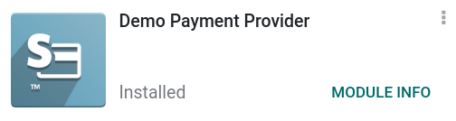
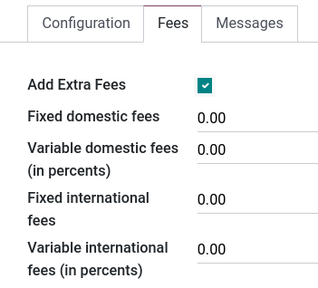

=====================
Demo payment provider
=====================

Odoo's **Demo Payment Provider** is a payment provider intended to test business flows involving
online payments without requiring credentials.

.. seealso::
   :doc:`../payment_providers`

Installation
------------

From Odoo's main dashboard, go into the **Apps** application, search for `demo`, and install the
:guilabel:`Demo Payment Provider` module. If the search gives no result, make sure no search filters
are applied.

Configuration
-------------

To enable the Demo payment provider, go to :menuselection:`Accounting --> Configuration -->
Payment Providers` and click on :guilabel:`Demo`. Change the state to :guilabel:`Test Mode` and set
the provider to :guilabel:`Published` (by default is set on :guilabel:`Unpublished`). Make sure to
enter a :guilabel:`Payment Journal`, such as **Bank**, for example.

Features
--------

Displayed as
~~~~~~~~~~~~

Enter the name you wish the **Demo Provider** to appear as during the test. Leave the field blank if
you prefer to leave it as default *(Demo Payment Provider)*.

Supported payment icons
~~~~~~~~~~~~~~~~~~~~~~~

Select the icons of the supported payment methods you want to display, such as *VISA, PayPal, etc*.

Allow saving payment methods
~~~~~~~~~~~~~~~~~~~~~~~~~~~~

Also known as **tokenization**, this option allows to save the payment method for future
transactions. Check the :guilabel:`Allow Saving Payment Methods` box to enable the feature.

.. note::
   In the case of real transactions, you remain fully PCI-compliant when enabling this feature as
   Odoo does not store the card details directly. Instead, it creates a payment token that only
   holds a reference to the card details stored on the payment provider’s server.

Manual capture
~~~~~~~~~~~~~~

This feature allows testing payment captures in two steps instead of one. When you authorize a
payment, the funds are (in the case of real transactions) reserved on the customer's payment method
but they are not immediately charged. The charge is only made when you manually decide to capture
the payment at a later date.

Check the :guilabel:`Capture Amount Manually` box to enable the feature.

Refunds
~~~~~~~

You can refund payments directly from Odoo, it does not need to be enabled first. To refund a
payment, navigate to it by going to :menuselection:`Accounting --> Customers --> Payments`, and then
click on the :guilabel:`Refund` button.

Fees
~~~~

Under the :guilabel:`Fee` tab, you can find the option to add **extra fees** on transactions. Once
the :guilabel:`Add Extra Fees` box checked, the following options are available:

**Fixed** fees are determined by the amount entered in the field. The amount is then added to the
tax-included price.

**Variable** fees are determined by the percentage entered in the field. The percentage is
calculated on the tax-included price and then added on top of that price.

**Domestic fees** are applied only to transactions occurring within the country of the company
configured in the :menuselection:`General Settings --> Companies`.

**Variable** fees are applied only to transactions occurring outside of the country of the company.

