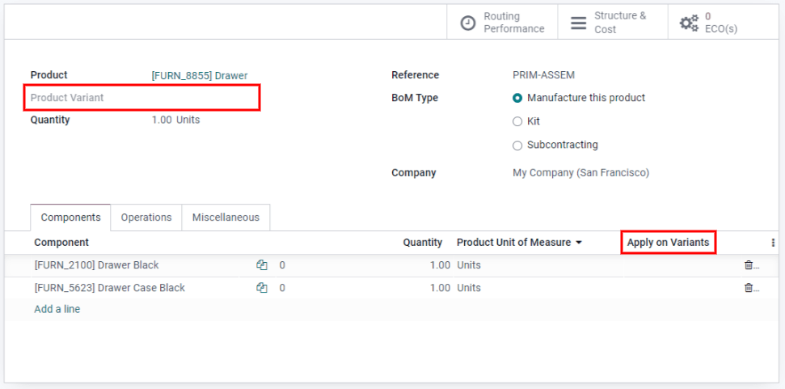

==========================
Create a Bill of Materials
==========================

A *Bill of Materials* (BoM) is a document that defines the quantity of each component required to
make or deliver a finished product. It can also include various operations and the individual step
guidelines needed to complete a production process.

In Odoo Manufacturing, multiple BoMs can be linked to each product, so that even product variants
can have their own tailored BoMs.

Correctly setting up a BoM helps optimize the manufacturing process and save time.

Setting up a BoM
================
The simplest BoM setup is one without operations or instructions, only components. In this case,
the production is solely managed using *Manufacturing Orders*. 

To create a BoM from the :guilabel:`Manufacturing` module, go to :menuselection:`Products --> Bills
of Materials`. Then, click :guilabel:`Create`. Next, specify the :guilabel:`Product`. Note that a
BoM can also be created directly from the product form. In that case, the :guilabel:`Product` field
is pre-filled. 

For a standard BoM, set the :guilabel:`BoM Type` to :guilabel:`Manufacture this Product`. Then
click :guilabel:`Add a Line` to specify the various components that make up the production of the
final product and their respective quantities. New components can be created on the fly through the
BoM, or can be created beforehand in :menuselection:`Manufacturing --> Products --> Products
--> Create`. Finally, click :guilabel:`Save` to finish creating the BoM.

.. image:: bill_configuration/bom-form.png
   :align: center
   :alt: Set up a Bill of Materials.

Specify a BoM for a product variant
-----------------------------------

BoMs can also be assigned to specific *Product Variants*. There are two ways to set up BoMs for
product variants. Note that the product variant attributes must already be configured on the
product form.

The first method is to create one BoM per variant by creating a new BoM and specifying the
:guilabel:`Product Variant`. The second method is to create one master BoM that contains all of the
components, and specify which variant each component applies to using the :guilabel:`Apply on
Variants` column.

Operations
==========

Add an :guilabel:`Operation` to a BoM to specify instructions for production and register time
spent on an operation. To use this feature, first enable the :guilabel:`Work Orders` feature in
:menuselection:`Manufacturing --> Configuration --> Settings --> Operations`.

Then, when creating a new BoM, click on the :guilabel:`Operations` tab and click :guilabel:`Add a
line` to add a new operation. In the :guilabel:`Create Operations` box, give the operation a name,
specify the :guilabel:`Work Center` and duration settings. Like components, Odoo gives the option
to specify a product variant in the :guilabel:`Apply on Variants` field so the operation only
applies to that variant. Finally, click :guilabel:`Save & Close`.

.. note::
   Each operation is unique, as it is always exclusively linked to one BoM. Operations can be
   reused when configuring a new BoM, with the :guilabel:`Copy Existing Operations` feature.

.. image:: bill_configuration/copy-existing-operations.png
   :align: center
   :alt: Copy Existing Operations feature. 

By-Products
===========

A *By-Product* is a residual product that is created during production in addition to the main
product of a BoM. Unlike the primary product, there can be more than one by-product on a BoM.

To add by-products to a BoM, first enable the :guilabel:`By-Products` feature in
:menuselection:`Manufacturing --> Configuration --> Settings --> Operations`.

Once the feature is enabled, you can add by-products to a BoM by clicking on the
:guilabel:`Operations` tab and clicking :guilabel:`Add a line`. Then, name the by-product, and
indicate the :guilabel:`Quantity` and the :guilabel:`Unit of Measure`. If the BoM has configured
operations, specify exactly which operation the by-product is produced from in the
:guilabel:`Produced in Operation` field. Finally, click :guilabel:`Save`.
