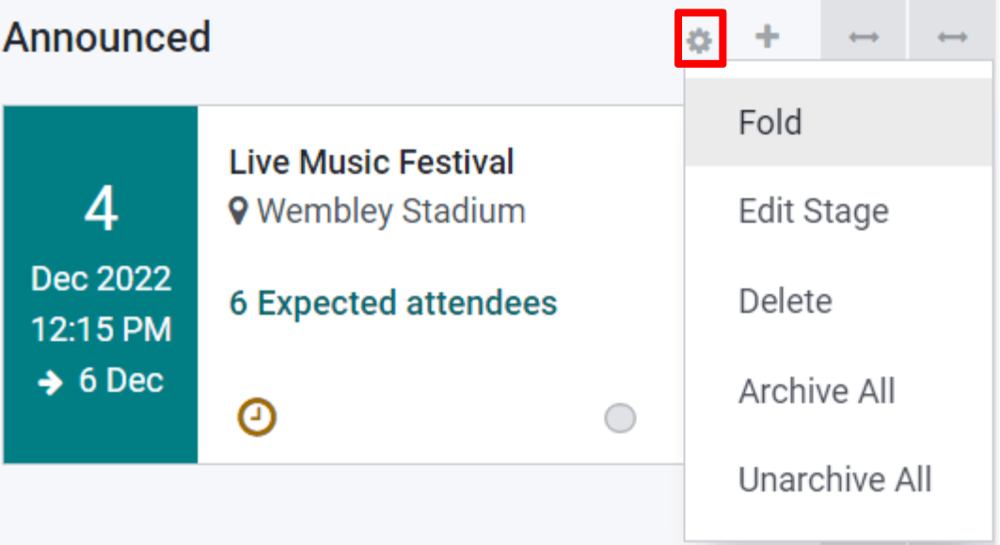
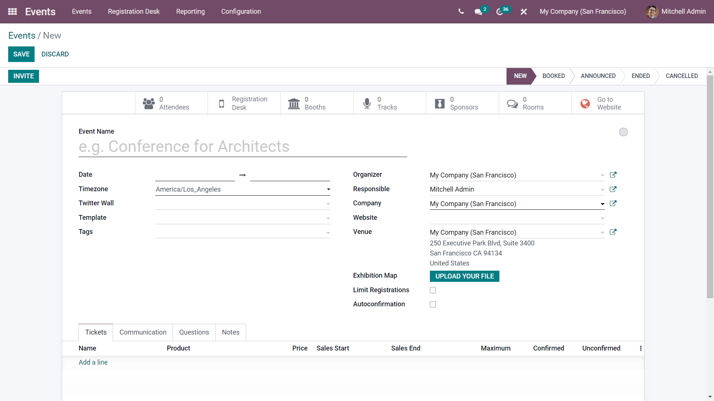
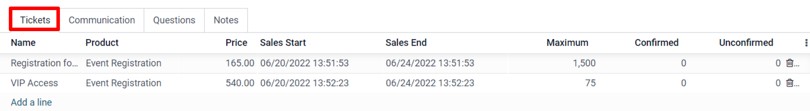
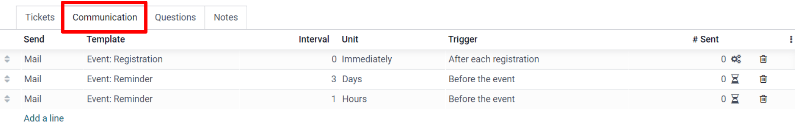
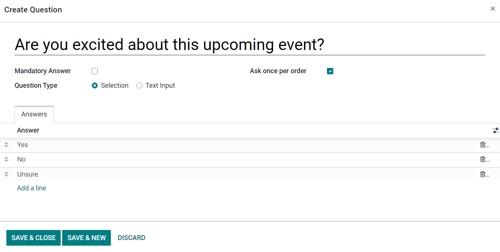
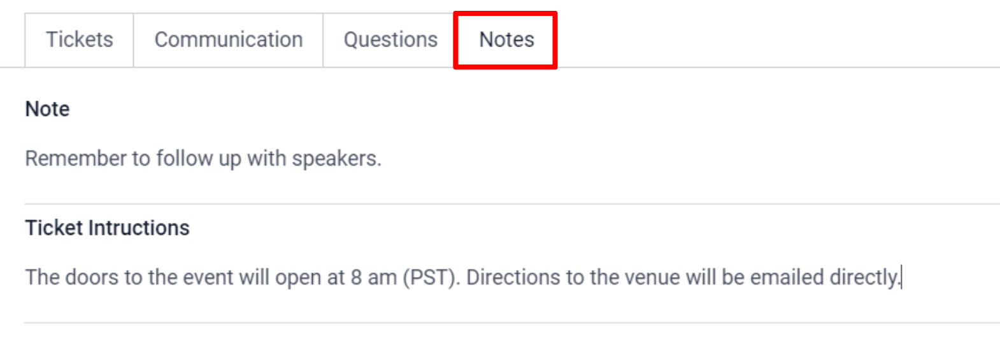
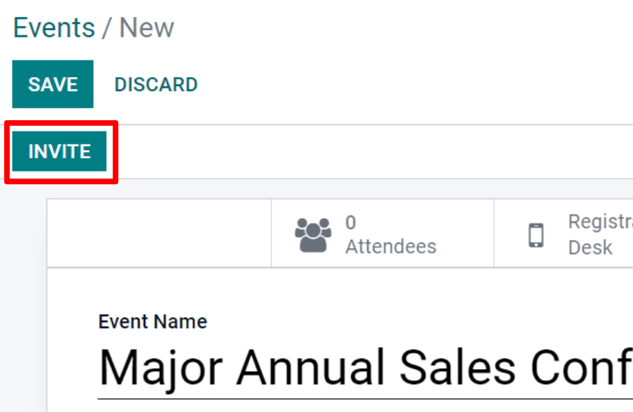
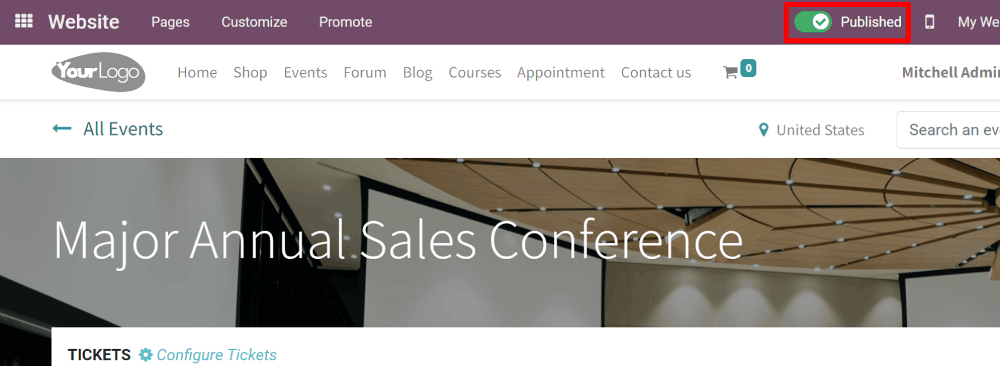

================
Creating a event
================

Events are important for a number of reasons. For starters, events allow for the creation of an
immersive, engaging experience with an audience. However, hosting a top-notch event isn't just
something that “happens.” It takes a lot of foresight, planning, and of course, execution.

For all those factors to go as smoothly as possible, your company will need a reliable solution
that not only allows for an easy set up of a high-quality event in a matter of minutes, but also
one that's equipped with a user-friendly interface that makes things abundantly simple to customize
and configure.

At the end of the day, it's your event - your rules. So, you'll need a multi-faceted solution
that'll help make your “dream event” a reality.

Overview
========

Upon clicking the :guilabel:`Events application`, Odoo will populate a dashboard, filled with an
overview of various pipeline stages. Key information is listed in a Kanban view, which includes the
number of expected (and confirmed) attendees.

To create a new stage, click :guilabel:`Add a Column` and proceed to give it a title; which should
appropriately represent your event management process.

To reorganize the stages, just drag-and-drop until they are in the correct order. Stages can be
“folded” for a cleaner presentation, via the :guilabel:`Settings` menu of each column.

The :guilabel:`Settings` of each column can be accessed via the gear icon to the right of each
column title. The gear icon, by default, is hidden and will appear next to the  :guilabel:`+` icon
when moused over. When clicked, a drop-down menu of settings will appear.

Create an event
===============

To create an event, click :guilabel:`Create` from the Events dashboard. Odoo will redirect the page
to a blank :guilabel:`Event template form`.

Then, proceed to fill out the event form with all the necessary information, either by selecting
existing data from each field or creating everything on-the-fly.

Tickets tab
-----------

Under the :guilabel:`Tickets` tab, lines can be added to include the different types of tickets the
event plans to offer. Here the ticket price will be determined, as well as the start/end date for
registrations, and adjust the maximum number of tickets that can be sold.

If selling tickets isn't necessary for the event, a simple :guilabel:`Registration` button will be
displayed on the event's page by default.

Communication tab
-----------------

Under the :guilabel:`Communication` tab, is the option to :guilabel:`add a line`, this allows for
the configuration and sending of a  personalized :guilabel:`email`, :guilabel:`SMS`, or
:guilabel:`social post` to keep in touch with the event attendees. The trigger for this action can
either be: :guilabel:`Before the event`, :guilabel:`After each registration`,
:guilabel:`After the event`.

A template can be created directly through the dropdown under the :guilabel:`Template` column, or
choose from an existing one. Next define the :guilabel:`Interval` (a number), the :guilabel:`Unit`
(hours, days, weeks, months, etc.), and the :guilabel:`Trigger` (after registration, before the
event, etc.).

Questions tab
-------------

Creating a unique questionnaire is an effective way to gauge the wants/needs of your audience,
while collecting data for analytical purposes.

First, navigate to :menuselection:`Configuration → Settings` and enable :guilabel:`Questions`.

Once this option is enabled under the *Questions* tab, questions and answers can be added. There
will also be the options to :guilabel:`Ask once per order` or :guilabel:`Mandatory Answer` which
will make the question required.

For example, if :guilabel:`Once per order` is chosen then a single registration for 3 attendees
will show the questionnaire once.

Notes tab
---------

Under the *Notes* tab, there is the option to :guilabel:`Add a note` and/or
:guilabel:`Ticket instructions`.

Event invites
-------------

When you've successfully created an event, it's time to invite people to it. To do that, click
*Invite* and Odoo will redirect the page to an invite template form, that can be emailed or sent
out as an SMS. The message can be fully customized and recipients can be added.

Then, once you're happy with how the message looks, click on :guilabel:`Send`,
:guilabel:`Schedule`, or :guilabel:`Test` it.

Publish your event
==================

If you don't publish your event, people will never be able to access it. So, once you're ready,
navigate to the event page on the front end and publish it.

To do that, go to the event form, and click the :guilabel:`Go to Website` smart button. Odoo will
redirect the page to the event page on the front end of the website. In the upper right corner,
toggle the switch from :guilabel:`Unpublished` to :guilabel:`Published`, and the event will be
instantly accessible on the website.

