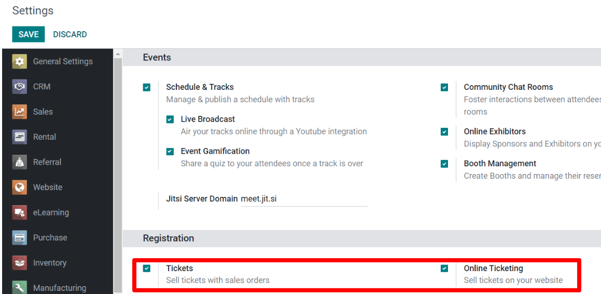
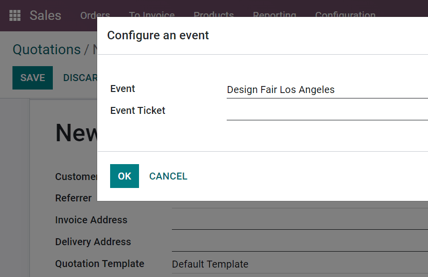
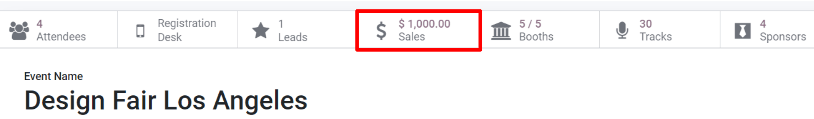
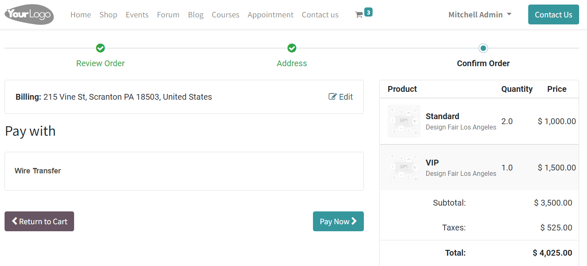

===============
Selling tickets
===============

In order to provide the best payment methods to the event attendees, Odoo offers plenty of options
to choose from. All of which automate processes, save valuable time, and can be based on
:guilabel:`Event Type`.

Configuration
=============

First, go to :menuselection:`Configuration --> Settings` and enable :guilabel:`Tickets` and
:guilabel:`Online Ticketing`.

:guilabel:`Tickets` will allow tickets to be sold.

:guilabel:`Online Tickets` will allow for the sale of tickets to occur through the website.

.. note::
   If these options are *not* enabled, a :guilabel:`Register*` button will still be available for
   free registrations.

Through sales orders
--------------------

In the :guilabel:`Sales` application, choose the event registration you created (as if it were a
product), and add it as a product line. Upon adding the registration, a pop-up appears, which
allows for the selection of the specific event (and that will be attached to this sales order.

Events with tickets sold through sales orders (or online) have a :guilabel:`Sales Smart Button`
shortcut at the top the event form. Clicking the :guilabel:`Sales Smart Button` will redirect the
page to all the sales orders related to that event.

.. image:: selling_tickets/events-tickets-registration-product.png
   :align: center
   :alt: View of an event form highlighting the column product under the tickets tab in Odoo
         Events.

Through the Website
-------------------

When tickets to an event are purchased on your website, the process is similar to creating a
:guilabel:`Sales Order` with the :guilabel:`Registration` product. Here, tickets are added to a
virtual cart, and the transaction can be completed (and finalized) as usual - utilizing any of the
pre-configured payment methods  set up on the website.

The completed purchase will automatically produce a :guilabel:`Sales Order`, which can be easily
accessed in the backend of the database.

