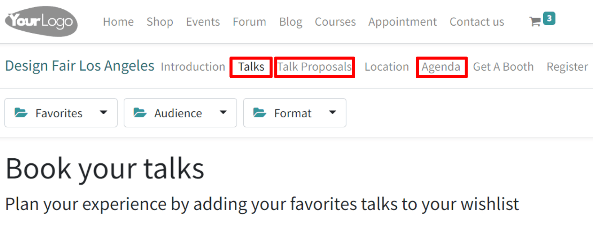
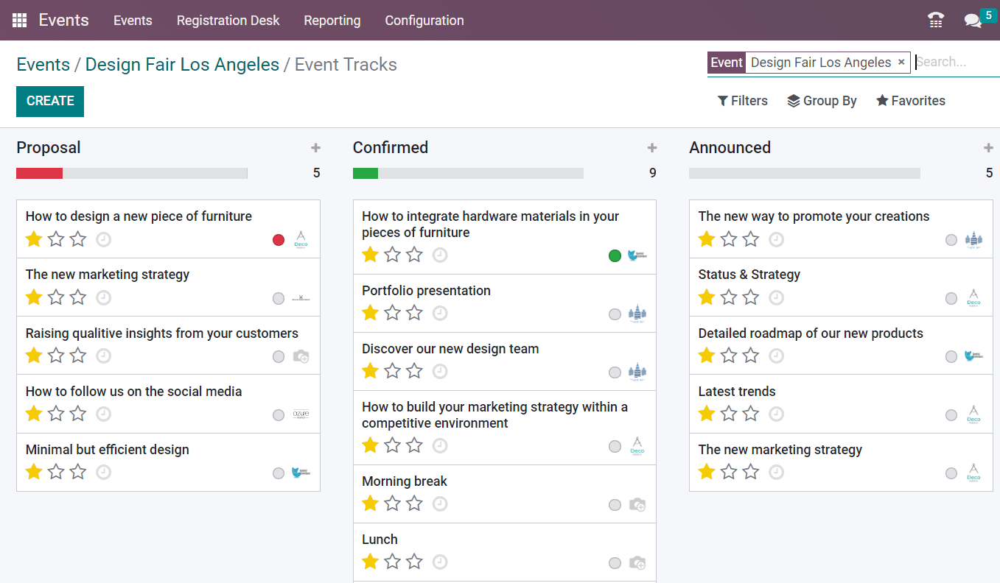
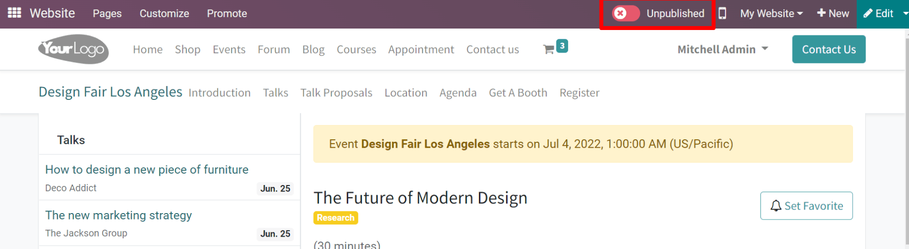
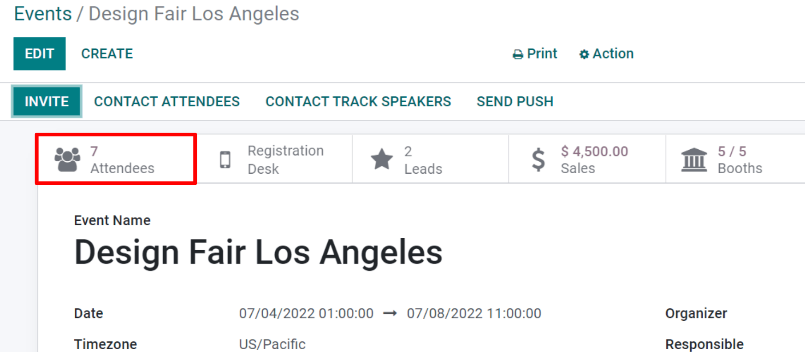
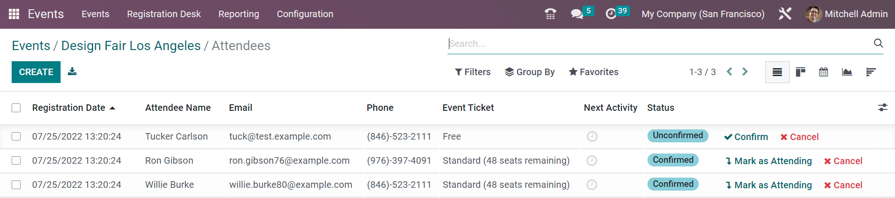
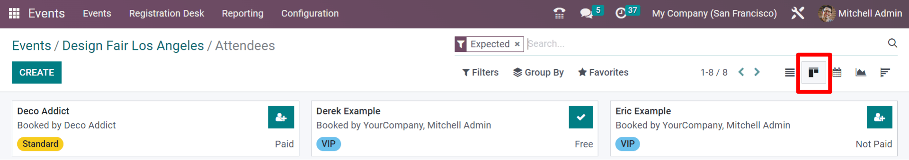
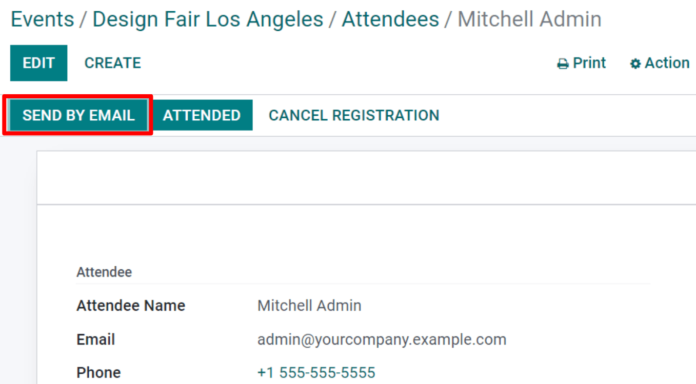
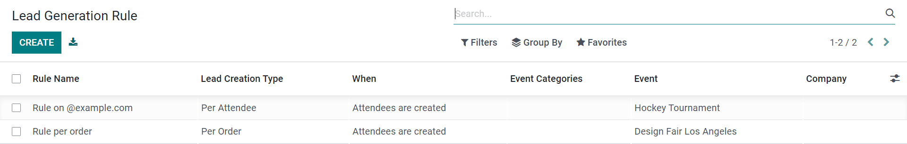
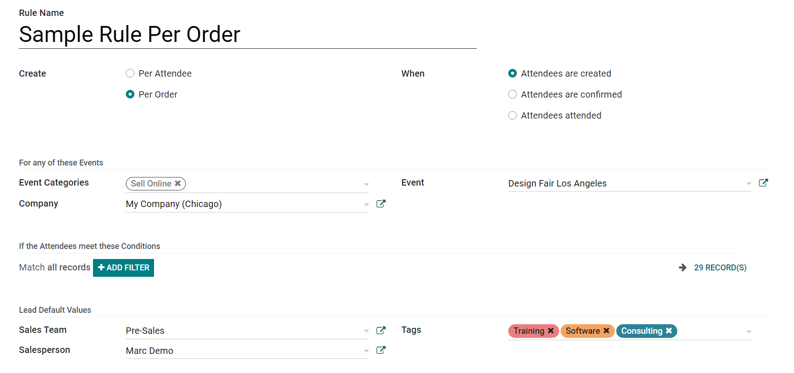

======================
Track and manage talks
======================

Sure, it's always a smart move to book diverse presenters and experts to speak on a variety of
different topics that your attendees will be interested in - but it's even *smarter* to provide
your attendees with the opportunity to propose presenters to speak at your events.

Configuration
=============

First, this option needs to be enabled; go to :menuselection:`Events → Configuration → Settings`
and enable :guilabel:`Schedule & Tracks`.

Afterwards, two more options will appear: *Live Broadcast* and *Event Gamification*

:guilabel:`Live Broadcast` allows for the airing of tracks online through a YouTube integration.

:guilabel:`Event Gamification` allows for the sharing of a quiz with your attendees once a track
(talk) is over.

In order to deliver the best possible event experience, try enabling both of these features.

Once enabled, take notice of the following menus that are automatically added to the website:
:guilabel:`Talks`, :guilabel:`Talk Proposals` and :guilabel:`Agenda`. Any attendee can freely
access these menus at any time.

Managing talk proposals
=======================

Once users have appropriately filled out the Talk Proposal form on the website, and officially
submitted it, a new :guilabel:`Proposal` is instantly created for the event.

All talks (Proposals, Confirmed, Announced, etc.) are accessible via the :guilabel:`Tracks` smart
button on the event form.

If a proposal is accepted, move the :guilabel:`Event Track` to the appropriate stage in the Kanban
view (i.e. `Confirmed` etc.), and then navigate to the talk's page on the front-end of your
website, in order to publish it. Without publishing it, attendees will never be able to access the
talk.

To do that, go to the :guilabel:`talk form`, and click the :guilabel:`Go to Website` smart button.
Odoo will redirect the page to the talk page on the front end of the website. In the upper right
corner, toggle the switch from :guilabel:`Unpublished` to :guilabel:`Published`, and the talk
will be instantly accessible on the website.

Track attendees
===============

Attendees are at the heart of any event. That's why keeping track of each one is of the utmost
importance. Odoo Events helps you keep track of (and manage) everything related to your attendees,
which will come in handy during the analysis of your event. The lessons learned from such data are
crucial for the planning of future events.

Attendees list and attendance
-----------------------------

Once attendees have registered or purchased tickets, they are added to the Attendee List, which is
accessible via the :guilabel:`Attendees` smart button on the event form.

When looking at the :guilabel:`Attendees list`, there is the option to view this information in a
number of different ways.

Each view will present the same information, only in a slightly different layout. To change the
view, click on the icons in the upper right hand of the screen.

In the Kanban view, it can be confirmed whether the attendees have already paid or remain unpaid.

Lastly, when the attendee arrives at the event, they will be marked as attending
(:guilabel:`Confirmed Attendance`), and the status of that attendee will change to
:guilabel:`Attended.`

Remember: Tickets sold through sales orders validate attendees as soon as the quotation is
confirmed.

Manage registrations
--------------------

Upon selecting an attendee from that list, Odoo will redirect the page to the specific attendee's
detail form.

From here, event badges can be sent manually by selecting :guilabel:`Send By Email`. The
:guilabel:`Attendee` can be marked as :guilabel:`Attended` or the registration can be canceled
altogether (via the :guilabel:`Cancel Registration` button).

         Events.

Lead Generation Rules
---------------------

With Odoo, leads can be generated from your events.

To create (and configure) Lead Generation Rules related to events, navigate to
:menuselection:`Configuration --> Lead Generation`.

On the :guilabel:`Lead Generation Rule` page, every configured Lead Generation Rule can be found,
along with pertinent data related to that rule.

To create a new Lead Generation Rule, click :guilabel:`Create`, and fill out the Lead Generation
Rule form to fit your company needs.

Configure *how* the lead should be created (:guilabel:`Per Attendee` or :guilabel:`Per Order`)
*when* they should be created, (:guilabel:`Attendees are created`,
:guilabel:`Attendees are confirmed`, :guilabel:`Attendees attended`), and numerous other settings
and configurations.
