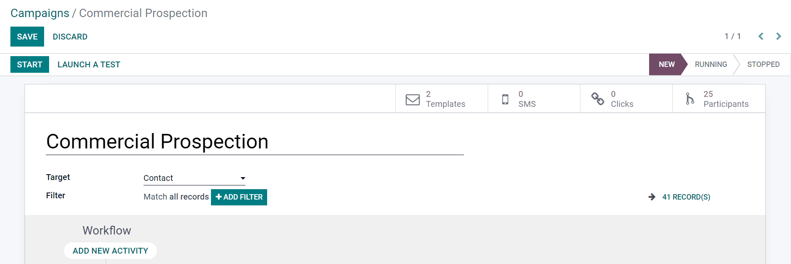
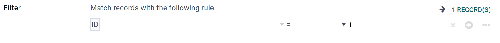

====================
Marketing Automation
====================

With Odoo, you can automate a variety of marketing tasks, duties, posts, and messages. Doing so,
provides you with more time to work on more important projects, without neglecting your marketing
responsibilities.

Marketing Templates
===================

Marketing templates allow you to quickly (and efficiently) create marketing campaigns using Odoo.

- :guilabel:`Templates` - represents the number of pre-configured mail templates being used in this
  particular campaign. (You can always create templates on-the-fly, as well).
- :guilabel:`SMS` - represents the number of personalized SMSs connected to this campaign.
- :guilabel:`Clicks` - represents the number of times attached links have been clicked by
  recipients of this campaign.
- :guilabel:`Participants` - represents the number of contacts that have directly participated in
  this campaign.
- :guilabel:`Target` - this field is a drop-down menu, in which you choose how you'd like to model
  your target audience (i.e. by Contacts, Sales Order, Lead/Opportunity, etc.).

Campaign Filters
================

If you choose to add a filter to your target audience, click 'Add Filter,' and a node field will
appear. In that node field, you can enter a custom equation for Odoo to use when filtering who to
include (and exclude) in this specific marketing campaign. 

Odoo provides users with the opportunity to customize their target audience by creating rules that
records must match, in order to be involved in this marketing campaign.

When the first field of the node is clicked, a massive drop-down menu of options appears, in which
you can freely choose which criteria best fit your needs for any particular campaign.

The remaining fields allow you to further drill down the criteria you want Odoo to utilize, when
determining which records to include (or exclude) in the execution of this campaign.

To add another node, simply click the “+” icon to the right of the filtering rule.

To add a branch of nodes at once, click the “...” icon.

.. note::
   :guilabel:`Records` represent the number of contacts in your system that fit the specific
   criteria you've specified for a campaign.
