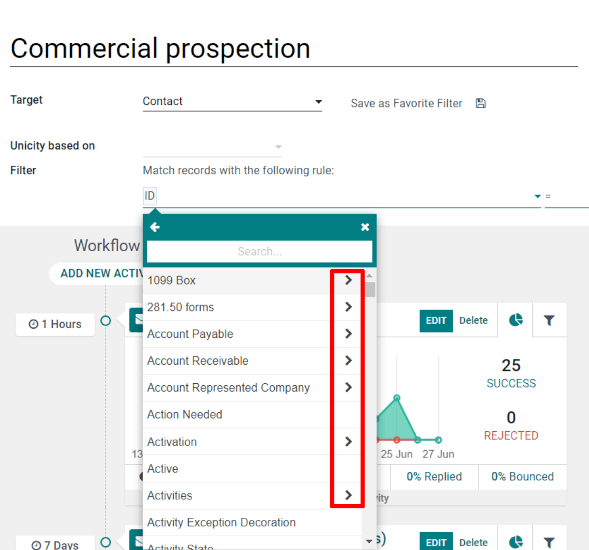
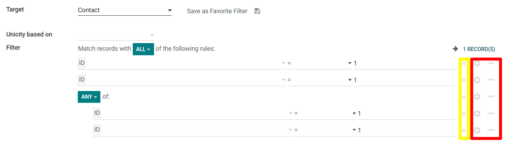
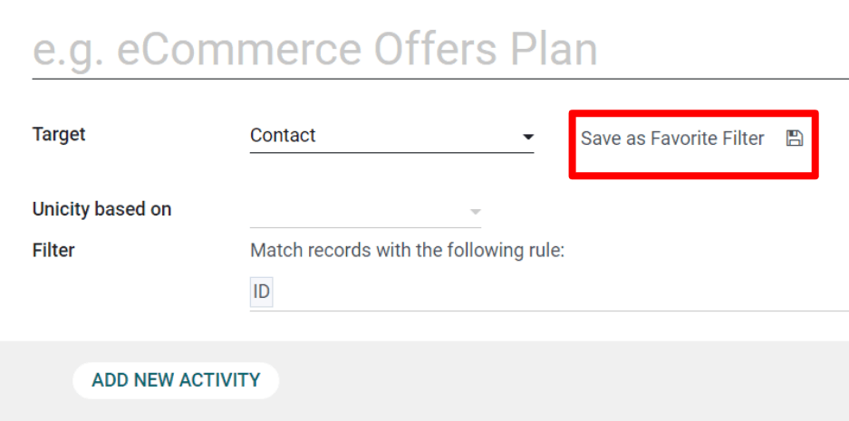

====================
Target your audience
====================

Getting your marketing campaigns to the *right* audience is paramount when trying to grow your
business. Fortunately, the :guilabel:`Odoo Marketing Automation` application provides you with the
right tools to take your marketing strategies to the next level.

How to work with target filters
===============================

When configuring the filters, there are some rules that have an arrow icon beside them, this
signifies that the parameter has more variables within it. 

More than one parameter line can be configured. A :guilabel:`node (+)` - can be added under what is
called a :guilabel:`branch (…)`. To add a node click on the :guilabel:`+` icon and to add another
branch click on the :guilabel:`three dots icon (...)`. 

To exclude a :guilabel:`node` (or a :guilabel:`branch`), click on :guilabel:`Delete node (x)`.

Every time a new branch is created, there are two options, either the records can match
:guilabel:`all` criteria for the upcoming rules, or :guilabel:`any` (meaning one rule or the
other). To change between these two options simply click the drop down arrow icon in the green box
and select :guilabel:`Any` or :guilabel:`All`.

Use Cases
=========

**Scenario**: Narrow the target down to new opportunities in the pipeline.

.. image:: target_audience/filters3.png
   :align: center
   :alt: A standard scenario using filters in the Odoo Marketing Automation app.

**Scenario**: Narrow the target down to suppliers.

.. image:: target_audience/filters4.png
   :align: center
   :alt: A sample of a supplier-related filter scenario in Odoo Marketing Automation.

**Scenario**: Narrow the leads down to the ones that contain a certain tag name.

.. image:: target_audience/filters5.png
   :align: center
   :alt: An example of what a tag name filter looks like in Odoo Marketing Automation.

**Scenario**: Narrow the target down to the attendees of a specific event that purchased a specific
category of ticket.

.. image:: target_audience/filters6.png
   :align: center
   :alt: How an event ticket filter appears in the Odoo Marketing Automation application.

**Scenario**: Narrow the target down to the employees who have kids.

.. image:: target_audience/filters7.png
   :align: center
   :alt: A filter based on the number of children an employee has in their family.

**Scenario**: Narrow the target down to records with a :guilabel:`Helpdesk` ticket solved.

.. image:: target_audience/filters8.png
   :align: center
   :alt: A standard Helpdesk ticket related filter in Odoo Marketing Automation.

Favorite Filters
================

Custom filters can be saved for future use in Odoo in just one click. 

Once the custom filter has been configured, there is an option to save it, by clicking the
:guilabel:`Disc Drive` icon next to the :guilabel:`Upload a favorite filter` field.

When clicked, a tiny pop-up will appear. 

Here, a title can be added to the :guilabel:`Favorite Filter`. Then click :guilabel:`Add` to save
the filter. An overview of all Favorite Filters is accessible under  :guilabel:`Configuration` >
:guilabel:`Favorite Filters`.
