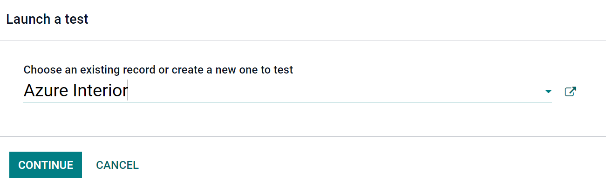
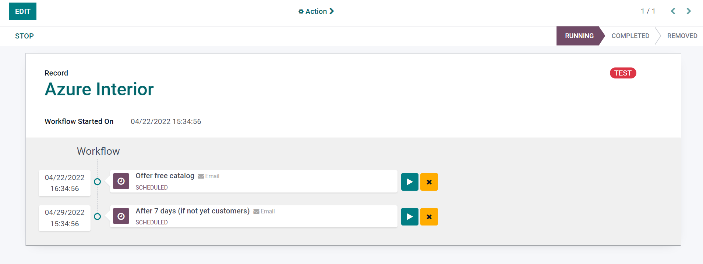
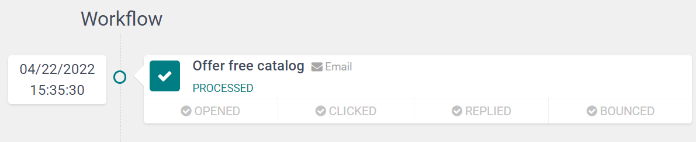

Testing & Running
=================

Odoo gives users the ability to test marketing campaigns (and mailings) before officially running
them. 

To start a test, click the 'Launch a Test' button at the top of the template form.

When clicked, a pop-up appears, in which you can choose a specific record to run the test on. Or,
you can create a brand new record to test.

Once you've selected the record you want to test, you'll click 'Continue,' and Odoo will redirect
you to the campaign test page.

Here, you'll see the name of the Record you're testing, along with the precise time this workflow
was started. Beneath that, you'll find your first activity (or activities) in the workflow.

To start a test, click the 'Run' icon beside the first activity in the workflow. When clicked, the
page will reload, and Odoo will show you the various results (and analytics) connected to that
specific activity.

