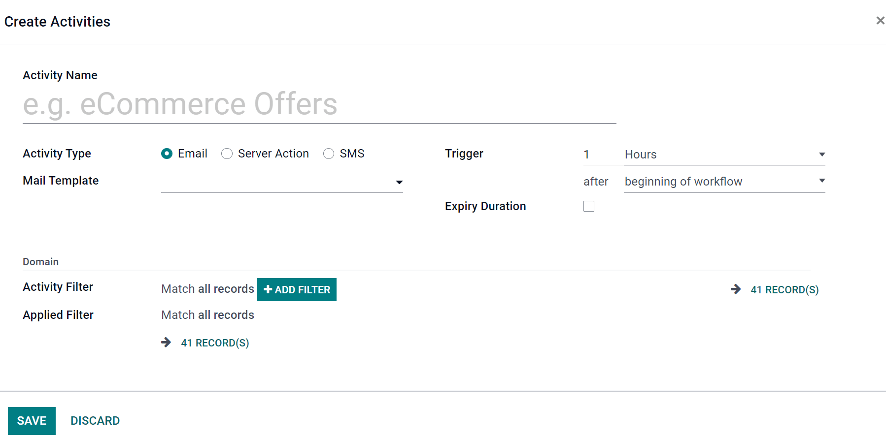
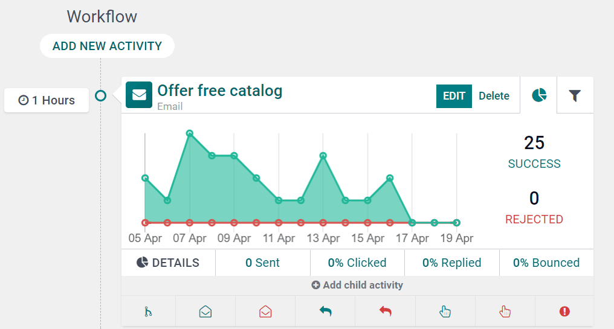

Marketing Activities
====================

Below, in the Workflow area, you can click 'Add New Activity' to add, edit, and customize different
marketing activities to coincide with your marketing campaign.

When you select 'Add New Activity,' a blank activity template will appear.

- :guilabel:`Activity Name` - the title of your activity.
- :guilabel:`Activity Type` - choose between Email, Server Action (internal Odoo operation), or SMS.
- :guilabel:`Mail Template` - choose from pre-configured templates (or create a new one on-the-fly).
- :guilabel:`Trigger` - choose when this activity should be triggered.
- :guilabel:`Expiry Duration` - if you want your actions to stop after a specific amount of time
  (after the scheduled date). When selected, a 'Cancel after' field appears, in which you can choose
  how many Hours, Days, Weeks, or Months you want your actions to cease after the initial date.
- :guilabel:`Activity Filter` - domain related to this activity (and all subsequent Child Activities).
- :guilabel:`Applied Filter` - activity will **only** be performed if it satisfies your specific
  domain (filter).

Workflow Activity
=================

Once saved, your Workflow Activity will appear in Odoo. Each activity will be shown as a graph (by
default). The configured trigger time for that activity can be found to the left of the Workflow
Activity.

You'll also find the number of activities that are successful (and rejected). The 'Success' (green)
and 'Rejected' (red) numbers are color-coded in the graph for easy reference. 

Beneath the Workflow Activity data, you'll see more in-depth analytics detailing how many have been
sent, and what percentage of those have been Clicked, Replied to, or Bounced.

Child Activities
================

Odoo also gives you the option to 'Add Child Activity.' 

'Child Activities' are sub-activities that are connected to (and triggered by) the activity above
it, which is also known as its 'Parent Activity.'

Odoo provides a number of triggering options to launch a Child Activity - all of which depend on
the Trigger configurations related to the activity. 

You can choose to trigger a activity in the following ways:

- :guilabel:`Add Another Activity` - instantly add another activity.
- :guilabel:`Opened` - the next activity will be triggered if the recipient opens the mailing.
- :guilabel:`Not Opened` - the next activity will be triggered if the recipient doesn't open the
  mailing.
- :guilabel:`Replied` - the next activity will be triggered if the recipient replies to the mailing.
- :guilabel:`Not Replied` - the next activity will be triggered if the recipient doesn't reply to
  the mailing.
- :guilabel:`Clicked` - the next activity will be triggered if the recipient clicks on a link
  included in the mailing.
- :guilabel:`Not Clicked` - the next activity will be triggered if the recipient doesn't click on a
  link included in the mailing.
- :guilabel:`Bounced` - the next activity will be triggered if the mailing is bounced (not sent).
