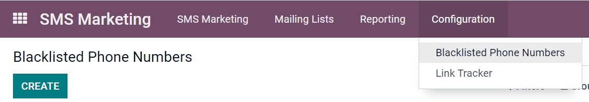

====================
Contacts & Blacklist
====================

Creating (or importing) your *own* list of contacts is extremely useful if you want to create
groups of specific people, like subscribers to your newsletter, for example. It's also the best way
to get started if you are migrating from another system, and already have a built-in audience. 

Utilizing contacts like this with Odoo :guilabel:`SMS Marketing` makes the entire SMS distribution
process easier than ever before.

Contact lists
=============

Go to :guilabel:`Mailing Lists` > :guilabel:`Mailing Lists` > :guilabel:`Create`.

Choose a name for the :guilabel:`Mailing List`, and activate the option
:guilabel:`Show in preferences`, to make the mailing list accessible to the recipients on the
:guilabel:`Subscription Management page` (allowing users to update their subscription preferences
at any time).

.. image:: contacts_blacklist/sms-mailing-list.png
   :align: center
   :alt: How to create an SMS mailing list.

History with log notes
----------------------

An accessible record of the sent mailings is kept on each recipient's :guilabel:`Chatter`. 

Database users can reference the :guilabel:`Chatter` to easily keep track of communications, and
see a history of interactions with contacts and prospects.

Example: A sales representative can use the :guilabel:`Chatter` to quickly find out which SMS
mailing promotions a certain customer has received (or not received).

.. image:: contacts_blacklist/sms-marketing10.png
   :align: center
   :alt: What the chatter looks like in Odoo.

Blacklist
=========

:guilabel:`Odoo SMS Marketing` has a :guilabel:`blacklist feature` that allows for phone numbers to
be added on if customers don't want to be contacted. 

This process is known as the blacklist or unsubscribe process. Customers will automatically be
added onto the blacklist if they :guilabel:`unsubscribe` via the
:guilabel:`subscription management page`. Customers can also be added manually to the blacklist. 

Go to :guilabel:`Configuration`> :guilabel:`Blacklisted Phone Numbers` > :guilabel:`Create`.

During a software/platform migration, it is possible to import an already existing blacklist of
contacts. This would include customers, who have already asked to be :guilabel:`Blacklisted` on SMS
mailings.

To do that, go to :guilabel:`Configuration` > :guilabel:`Blacklisted Phone Numbers` >
:guilabel:`Favorites`> :guilabel:`Import records`

