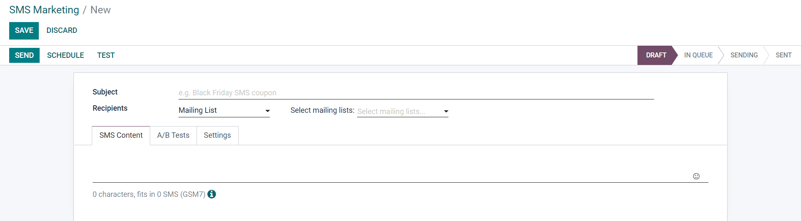
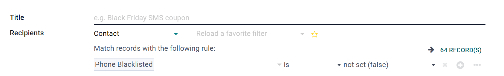
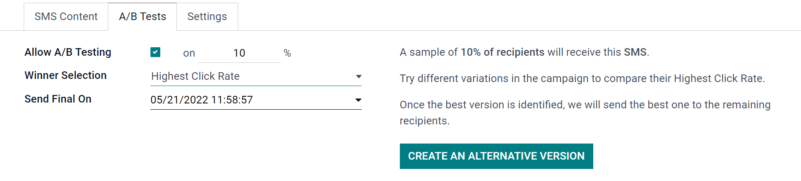
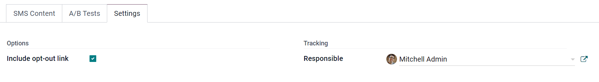
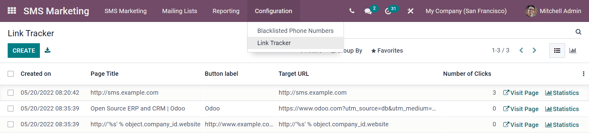

===============
First campaigns
===============

Utilizing SMS (Short Message Service) mailings in your company's communication strategies will help
you expand your markets, especially considering that, in some countries, emails aren't very common
(or used at all). 

:guilabel:`SMS Marketing` also helps you boost conversion rates - mostly because SMS mailings have
an extremely high open-rate percentage.

Getting started
===============

Go to :guilabel:`SMS Marketing` ‣ :guilabel:`Create`.

First, give the mailing a 'Subject' that will describe what the mailing is about.

Under :guilabel:`Recipients,' choose to whom this SMS will be sent. If :guilabel:`Contact` is
chosen, for example, all of the Odoo contacts in the database (vendors, customers, etc.) will
receive your SMS.

From there, the Recipients list can be refined with the :guilabel:`Add Filter` option. In the
example below, the message will only be sent to contacts who haven't chosen to
:guilabel:`Blacklist` their contact information using the :guilabel:`Unsubscribing` process.

Conversely, the :guilabel:`Mailing List` option allows for a specific mailing list (created by you)
to be chosen to receive the SMS. Multiple mailing lists can be selected, if necessary.

.. image:: first_sms_campaign/sms-marketing3.png
   :align: center
   :alt: Mailing list recipients on SMS marketing.

The content of the SMS will be entered in the text field found under the :guilabel:`SMS Content`
tab. Links can also be included. When links are used, Odoo automatically generates link trackers to
generate analytical data/metrics related to these specific links.

Under the :guilabel:`A/B Tests` tab, you'll initially find a single checkbox, labeled:
:guilabel:`Allow A/B Testing.`

When clicked, a series of other options appear.

In the first field, enter a desired percentage of recipients to conduct the A/B Test on. 

Beneath the percentage field is the :guilabel:`Winner Selection` field. This is what Odoo will use
to determine the “success” of an A/B Test. In other words, this will tell Odoo how to pick a
“winning” A/B test.

The following sections are available: :guilabel:`Manual`, :guilabel:`Highest Click Rate`,
:guilabel:`Leads`, :guilabel:`Quotations`, or :guilabel:`Revenues`.

Finally, the :guilabel:`Send Final On` field is listed. This represents the date-time that will be
used by Odoo as a deadline to determine the “winning” mailing variation. Odoo will then send to the
remaining recipients who weren't involved in the test at that date-time.

.. tip::
   Quickly create different versions of the mailing to add to the A/B Test by clicking the
   :guilabel:`Create an Alternate Version` button.

.. note::
   Remember: the “winning” mailing variation will be based on the criteria selected in the
   :guilabel:`Winner Selection` field.

Under the :guilabel:`Settings` tab, there is the option to :guilabel:`Include opt-out link`. If
activated, the contact is able to unsubscribe from the mailing list, thus avoiding all future
mailings.

A user :guilabel:`Responsible` for the mailing can be set in the :guilabel:`Tracking` section of
the :guilabel:`Settings` tab.

.. tip::
  In the :guilabel:`Link Tracker` menu (under the :guilabel:`Configuration` header menu), the
  history of the links sent in SMS mailings can be viewed, including their analytics.

.. note::
   Double-check that the phone numbers of contacts are saved.

Send SMS
=========

.. image:: first_sms_campaign/sms-mailing-options.png
   :align: center
   :alt: SMS Mailing options on the template.

Once a mailing is created, choose (from the options below) when this mailing should be delivered.

:guilabel:`Send Now`: sends the message immediately. Consider using this option if the recipient
list isn't excessive.

:guilabel:`Schedule`: choose a day and time for Odoo to send the mailing. This is typically the
best option for mailings to send during a specific event. Such a method could be used to promote a
limited-time offer, or simply to plan the company's content strategy in advance.

:guilabel:`Test`: allows for an SMS to be sent to one or multiple numbers for test purposes.
Remember to use a comma between numbers, if there are multiple numbers being used as recipients.

Visualize reports
=================

On the :guilabel:`Reporting` page (accessible via the :guilabel:`Reporting` option in the header
menu), there are options to apply filters, measures, and view metrics in various layouts. These
various metric layouts allow for extensive performance analysis of the SMS mailings.

.. image:: first_sms_campaign/sms-reporting-page.png
   :align: center
   :alt: Reporting page in SMS Marketing.

.. tip::
  To check the price to send an SMS for your country, click on the :guilabel:`Information` icon.

.. image:: first_sms_campaign/sms-price-check.png
   :align: center
   :alt: SMS price check icon

.. note::
   Buy Credits: in order to take advantage of the app and its features, make sure there are enough
   credits purchased.

.. seealso::
   - :doc:`../pricing/pricing_and_faq`
