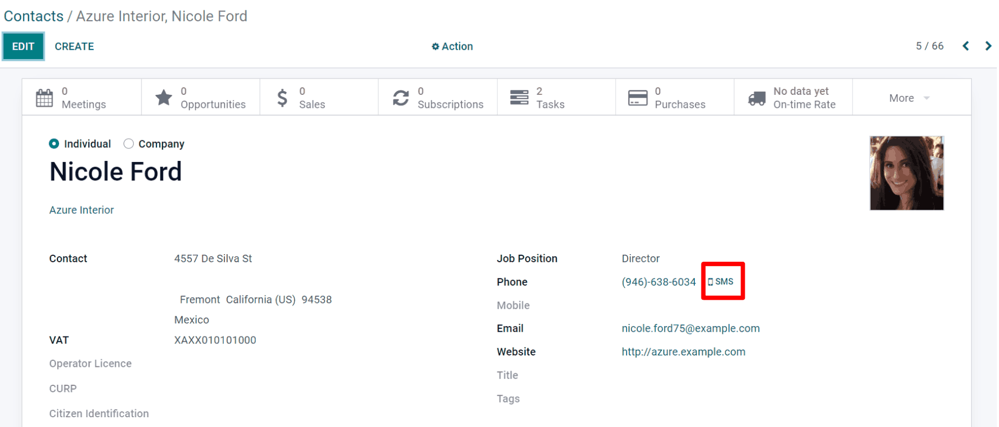
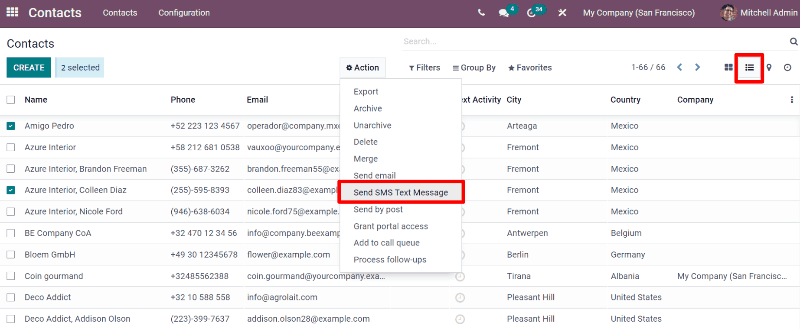
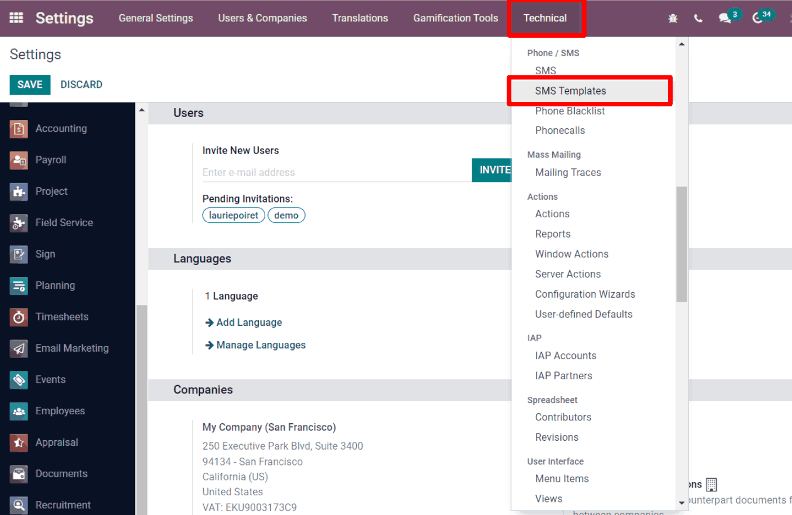

================
SMS Integrations
================

Utilizing SMSs to reach people isn't just an effective advertisement strategy, it's also a great
way to remind people about upcoming events, issued invoices, and so much more. 

Campaigns
=========

First and foremost, ensure that the :guilabel:`Mailing Campaigns` feature is activated.

To do that, go to :guilabel:`Email Marketing` > :guilabel:`Configuration` > :guilabel:`Settings`
and enable :guilabel:`Mailing Campaigns`.

.. image:: sms_integrations/sms-marketing12.png
   :align: center
   :alt: This is what the mailing campaigns setting looks like in Odoo SMS Marketing.

Once this is completed, the :guilabel:`Campaigns` menu becomes available in the
:guilabel:`SMS Marketing` app.

This provides an overview of the SMS mailings and campaigns, along with emails, social posts, and
push notifications. Now manage everything in a single, centralized place.

.. image:: sms_integrations/sms-campaign-template.png
   :align: center
   :alt: This is what an SMS campaign template looks like.

This particular feature is especially useful while working with aggregated campaigns. Odoo creates
stages in a Kanban view to better organize (and manage) all the work being done. 

.. image:: sms_integrations/sms-marketing14.png
   :align: center
   :alt: An example of the campaigns in a kanban view.

Sending SMSs through the Contacts app
=====================================

Sending SMS mailings directly through a contact's form is available by default. Doing so makes work
easier than ever, especially when sending an SMS to a specific contact.

In order to send an SMS, navigate to the :guilabel:`Contacts` app, select the desired
:guilabel:`contact`, and click on the :guilabel:`SMS` icon (next to their :guilabel:`phone number`)
on the :guilabel:`contact form`.

To send a message to multiple contacts at once, choose the *List View*, and select all the contacts
needed. Then, under :guilabel:`Action` select :guilabel:`Send SMS`.

Set up SMS templates
====================

In order to set up :guilabel:`SMS Templates`, you'll first need to activate
:guilabel:`Developer Mode`. Once activated, go to :guilabel:`Settings App`> :guilabel:`Technical` >
:guilabel:`SMS Templates`.

.. image:: sms_integrations/sms-template.png
   :align: center
   :alt: SMS Template page in Odoo.
