=================
Survey essentials
=================

Companies often use surveys to collect valuable information from their customers and/or employees,
which in turn, they use to make more informed business decisions.

Surveys can be used for a number of different purposes. They can be used to collect customer
feedback, evaluate the success of a recent event, measure the satisfaction of customers (or
employees), learn what the market is *really* thinking, and so much more.

Getting started
===============

To begin, click :guilabel:`Create` on the :guilabel:`Surveys` dashboard.

Odoo redirects the page to a blank survey template form. 

First, choose a :guilabel:`title` for the survey. Next, add a cover image to the survey by clicking
the :guilabel:`photo icon`. However, choosing a photo is not required.

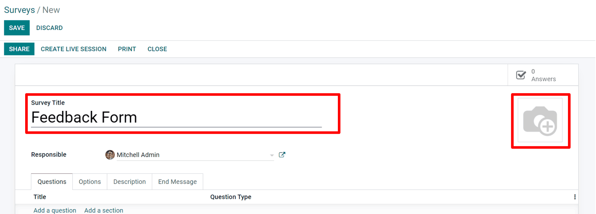

Below the :guilabel:`title` is an option to assign the responsibility of the survey to a user in
the database. Next, are various tabs in which the survey can be created, customized, and
configured. These tabs are labeled as follows: :guilabel:`Questions`, :guilabel:`Options`,
:guilabel:`Description`, and :guilabel:`End Message`.

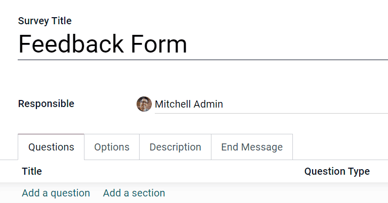

Questions tab
=============

Add questions and sections to surveys through the :guilabel:`Questions` tab. A section will divide
the survey into parts; to make one, simply click :guilabel:`Add a section` and type in a name.
Then add questions or drag and drop questions into the divided parts.

Clicking :guilabel:`Add a question` opens a pop-up to customize the survey question.

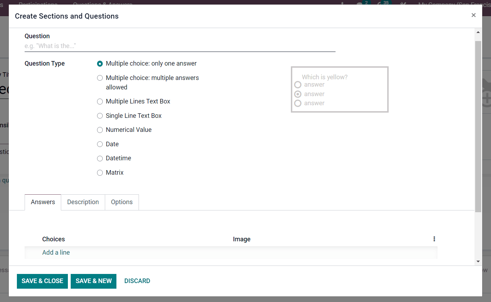

Create questions
----------------

After the question has been written in the "*Question*" field, choose the
:guilabel:`Question Type`. A preview of the question type is shown in the window, as well.

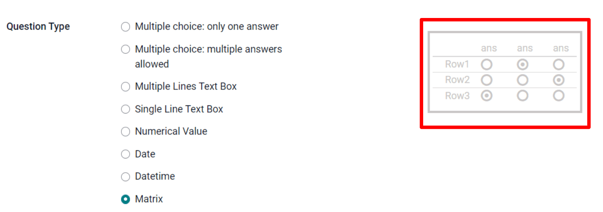

Choose from the following :guilabel:`Question Types` :

- :guilabel:`Multiple choice: only one answer`
- :guilabel:`Multiple choice: multiple answers allowed`
- :guilabel:`Multiple Lines Text Box`
- :guilabel:`Single Line Text Box`
- :guilabel:`Numerical Value`
- :guilabel:`Date`
- :guilabel:`Datetime`
- :guilabel:`Matrix`

.. note::
   Different features will appear in the :guilabel:`Answers` and :guilabel:`Options` tabs,
   depending on the :guilabel:`Question Type` chosen. However, the :guilabel:`Description` tab
   will always remain the same, regardless of what question is chosen.

Create Sections and Questions Tabs
~~~~~~~~~~~~~~~~~~~~~~~~~~~~~~~~~~

Once a :guilabel:`Question Type` has been selected, there are three possible tabs where information
can be customized for your question. These include the :guilabel:`Answers` (if applicable),
:guilabel:`Description`, and :guilabel:`Options` tabs. 

Each tab offers a variety of different features (depending on what :guilabel:`Question Type` was
chosen).

Odoo provides a plethora of professional features and options to enhance the quality of your
question, so be sure to check each tab for an array of unique aspects and elements. 

For example, in the :guilabel:`Options` tab, the following options may appear: 

- :guilabel:`Answers`

    - :guilabel:`Placeholder` (Help Participants know what to write)
    - :guilabel:`Show Comments Field`
    - :guilabel:`Validate Entry`
    - :guilabel:`Matrix Type` (How many choices per row)

- :guilabel:`Constraints`

    - :guilabel:`Mandatory Answer`

- :guilabel:`Layout`

    - :guilabel:`Conditional Display`

- :guilabel:`Live Sessions`

    - :guilabel:`Question Time Limit`

Conditional Display
*******************

:guilabel:`Conditional Display` means this question will only be displayed if the specified
conditional answer has been selected in a previous question.

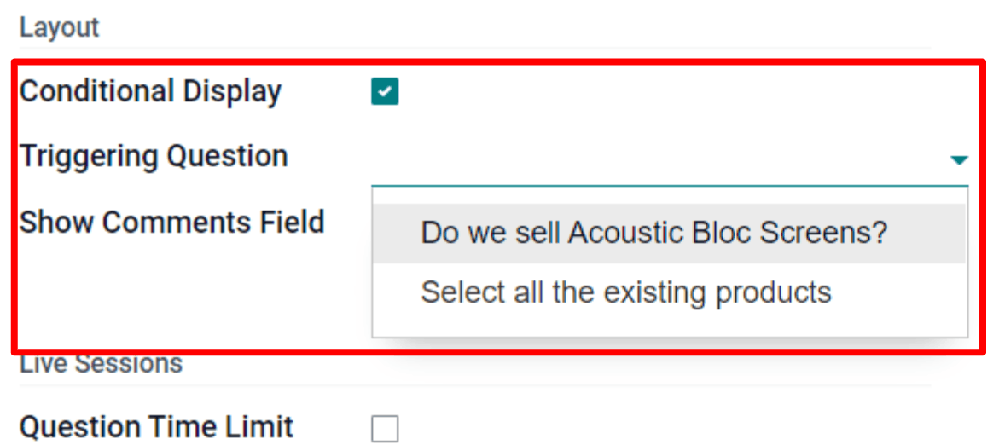

If the box next to :guilabel:`Conditional Display` is selected, the :guilabel:`Triggering Question`
field appears.

Then, once a :guilabel:`Triggering Question` is picked, a :guilabel:`Triggering Answer` field
appears.

Here, select which answer will trigger this :guilabel:`Conditional Display` question.

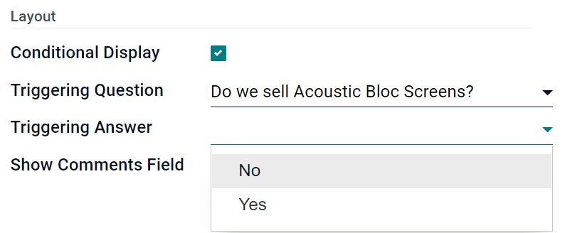

.. note::
   Click :guilabel:`Save & Close`, and Odoo will redirect the page back to the survey template
   page. There is also the option to click :guilabel:`Save & New` which will open another new
   question.

Options tab
===========

Back on the main survey template form, under the :guilabel:`Options` tab, there are different
sections of settings that can be modified.

The sections include:

- :guilabel:`Questions`
- :guilabel:`Time & Scoring`
- :guilabel:`Participants`
- :guilabel:`Live Session`

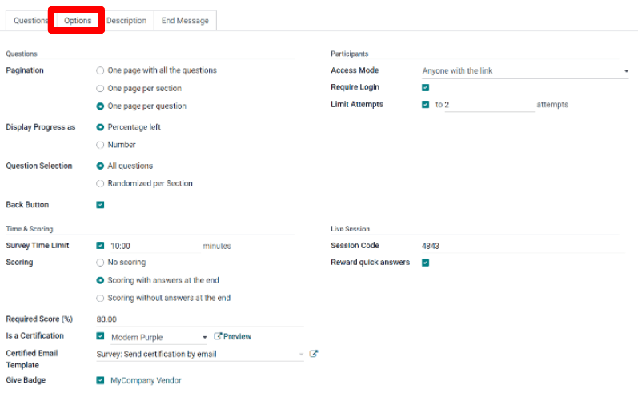

Questions
---------

This section primarily focuses on the overall presentation of your survey.

First, select the :guilabel:`Pagination` or the layout of the survey. The following options can be
chosen:

- :guilabel:`One page with all the questions`
- :guilabel:`One page per section`
- :guilabel:`One page per question`

Should either :guilabel:`One page per section` or :guilabel:`One page per question` options be
chosen then a section called :guilabel:`Display Progress as` will populate. It indicates how to
display the participant's progress during the survey. 

It can be shown as either a :guilabel:`Percentage left` or a :guilabel:`Number`.

After the :guilabel:`Display Progress as` option is a section labeled
:guilabel:`Question Selection`. Here questions can be randomized per section, in other words the
number of random questions can be configured by section. This mode is ignored in a live session.

There is also the option to provide participants with a `Back Button`, if desired. This option will
only appear should either :guilabel:`One page per section` or :guilabel:`One page per question`
options be chosen.

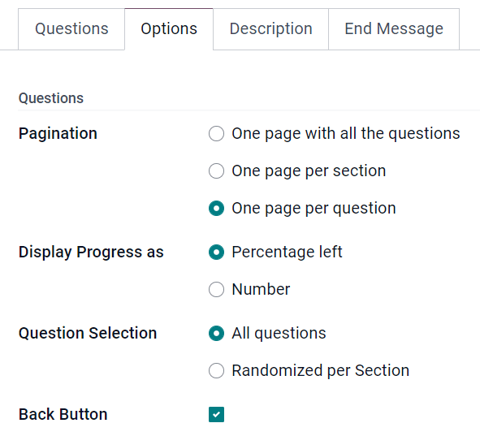

.. seealso::
    - :doc:`time_random`

Time & Scoring
--------------

In this section, you decide how you want the survey to be scored. 

The first option available is to add a :guilabel:`Survey Time Limit`. To implement this option,
simply check the box, and enter the amount of time (in minutes) participants will have to complete
the survey.

Beneath the :guilabel:`Survey Time Limit` are the various :guilabel:`Scoring` options.

The following options can be chosen:

- :guilabel:`No scoring`
- :guilabel:`Scoring with answers at the end`
- :guilabel:`Scoring without answers at the end`

If either the :guilabel:`Scoring with answers at the end` or
:guilabel:`Scoring without answers at the end` options are selected then a
:guilabel:`Required Score` field will populate.  

Next, there is the option to make the survey a certification. To do so, check the box next to the
option labeled :guilabel:`Is a Certification`," and two more additional fields will populate. 

A color theme can be selected and a :guilabel:`Certified Email Template` can be chosen. When
someone passes the certification with the required score an email will automatically be sent to
that person, using the selected email template. 

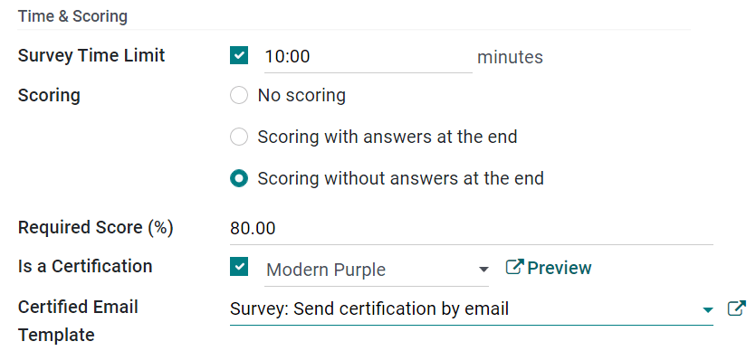

.. seealso::
    - :doc:`scoring`

Participants
------------

In the :guilabel:`Participants` section, access to the survey can be managed..

The :guilabel:`Access Mode` has two options to choose between: :guilabel:`Anyone with the link`
and :guilabel:`Invited people only`. 

Below the :guilabel:`Appraisal Managers Only` checkbox, is the option to require a login in order
to participate in this survey. If this option is activated then a :guilabel:`Limit attempts` field
will populate, in which the number of certification attempts can be defined for the person taking
the survey/certification.

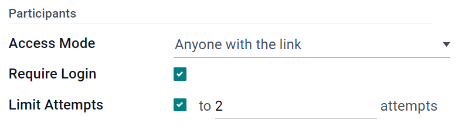

Live Session
------------

This section is dedicated to users who are conducting :guilabel:`Live Session` surveys, wherein
they directly engage with an audience and gather their answers in real-time.

Here, the specific :guilabel:`Session Code` can be customized; this will be needed for participants
to access the Live Session survey. Reward participants for quick answers by selecting the checkbox
labeled :guilabel:`Reward quick answers`. Attendees will get more points if they answer quickly.

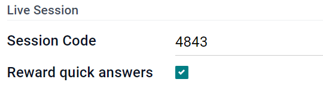

Description tab
===============

Back on the main survey template page is the :guilabel:`Description` tab where a custom description
of your survey can be added. This will be displayed beneath the title on the survey's homepage,
which is on the front end of the website made through the :guilabel:`Odoo Website` app.

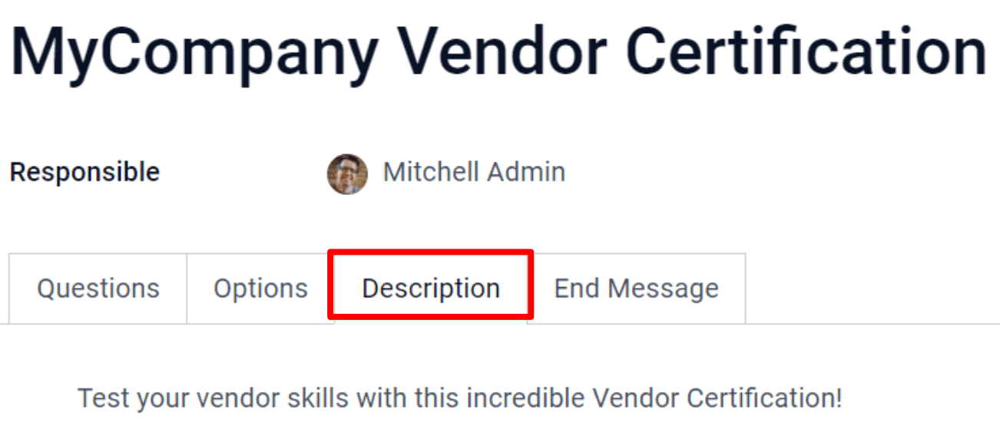

Here's what it looks like on the frontend of the website:

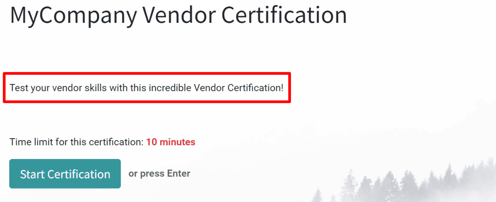

End Message tab
===============

In the *End Message* tab, there is a blank text field, with the option to write a personalized
message to the participants. This message will appear once the survey has been completed.

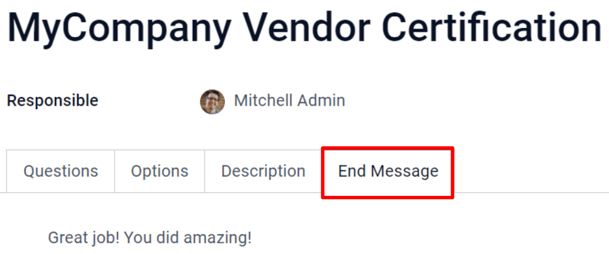

Here's what it looks like on your website:

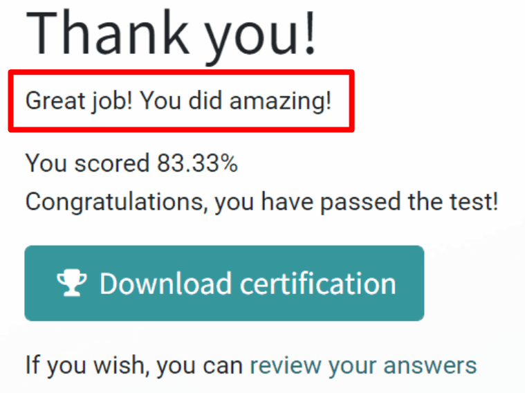

Test & Share
============

Once everything is created and saved, the survey can be tested to check for possible errors before
sending it out to the participants.

To do that, simply click *Test* in the upper left corner of the survey template page.

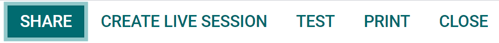

When clicked, Odoo redirects the page to a test version of the survey on the front end of the
website, this page displays how the survey will look to participants. Proceed to run through the
survey, like a normal participant, and check for errors.

Along the top of the page, there is a blue banner that reads: :guilabel:`This is a test survey`.
To return to the survey template form in the backend, simply click the :guilabel:`This is a test
survey. Edit Survey` link in the blue banner.

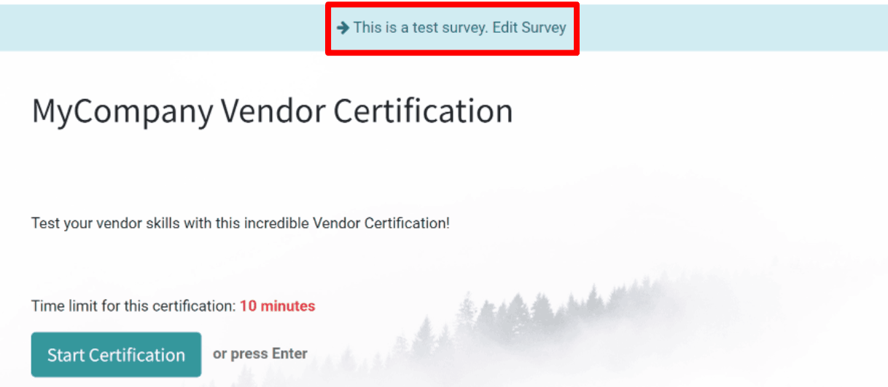

Once Odoo redirects the page to the survey template in the backend; make any necessary changes (or
modifications) before officially sending it out to potential participants.

When you're satisfied with how the survey looks, and you're ready to share it with your audience,
simply click *Share* in the upper-left corner.

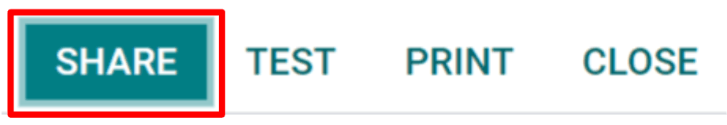

As answers get collected, check them by clicking the :guilabel:`Answers` smart button on the survey
template form, or the :guilabel:`See Results` button in the upper left corner.

.. seealso::
    - :doc:`scoring`
    - :doc:`time_random`
