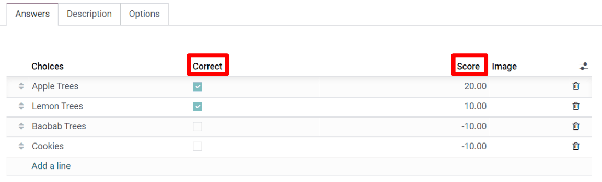

===============
Scoring Surveys
===============

To measure a participant's performance, knowledge, or overall satisfaction, it's best to ascribe
points to survey answers. These points are then summed up, resulting in the participant's final
score.

To add points to questions, open the desired :guilabel:`Survey Form` and (under the 
:guilabel:`Options` tab) choose between :guilabel:`Scoring with answers at the end` or
:guilabel:`Scoring without answers at the end`. This option is located under the
:guilabel:`Time and Scoring` section.

Then, on the :guilabel:`Question's form`, set the correct answer and attach a score. This can be
done by clicking on the question in the :guilabel:`Questions tab`.
 

Set the :guilabel:`Required Score (%)` back on the :guilabel:`Option tab`, in the
:guilabel:`Survey form`. This will determine what percentage a participant needs to earn with their
responses in order to consider their submission as “passing.”

If enabling the :guilabel:`Is a certification` option, then choose a
:guilabel:`Certification email template`. The certification will automatically be emailed to users
using this email template, who successfully complete the survey with a score that meets (or
exceeds) the preconfigured :guilabel:`Required Score (%)`.

.. image:: scoring/required-score-login.png
   :align: center
   :alt: Setting the Required Score (percentage), login required, and certification template.

If :guilabel:`Require Login` is enabled (in the :guilabel:`Participants` section), the option to
:guilabel:`Give Badge` appears beneath the :guilabel:`Certification` options in the
:guilabel:`Time & Scoring` section.

Badges are related to the eLearning portion of your website. Besides the logged-in user, website
visitors who access the :guilabel:`Courses` page will also be able to see the granted badges.

.. seealso::
    - :doc:`create`
    - :doc:`time_random`