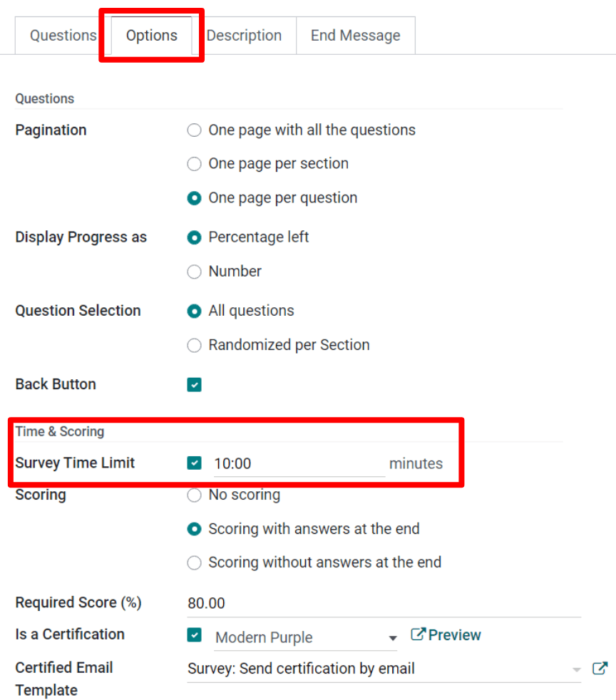
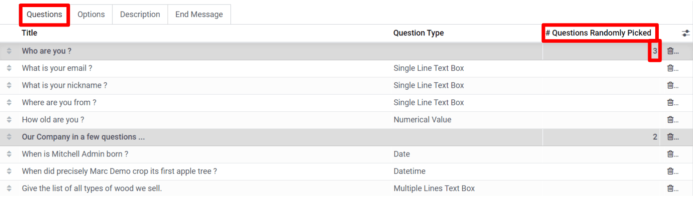

==============================
Timed and Randomized Questions
==============================

Time Limit
==========

During a timed survey, participants must finish the survey within a certain period of time. Placing
a time limit on your survey ensures that every participant gets the same amount of time to fill in
answers. It also greatly reduces the chance of participants looking up responses, via external
resources (Google, etc.).

The :guilabel:`Time Limit` field is found under the :guilabel:`Options` tab of the
:guilabel:`Survey Form` under the :guilabel:`Time and Scoring` section.

When a time limit is configured, a timer is displayed on every page of the survey, letting
participants keep track of the time remaining. Surveys that aren't submitted by the preconfigured
time limit will *not* have their answers saved.

Randomized Selection
====================

When a survey is randomized, Odoo shuffles the questions and reveals them in a random order every
time a participant begins the questionnaire. 

Randomizing surveys is an effective way to discourage participants from looking at each other's
responses.

To randomize a survey, click the :guilabel:`Options` tab on the :guilabel:`Survey form`, and enable
:guilabel:`Randomized per section` in the :guilabel:`Questions` section. 

After enabling this feature, navigate to the :guilabel:`Questions` tab, and determine how many
questions (per section) Odoo should take into account during the shuffling of questions. The number
of questions is specified per each :guilabel:`Section`.

.. seealso::
    - :doc:`scoring`
    - :doc:`create`
