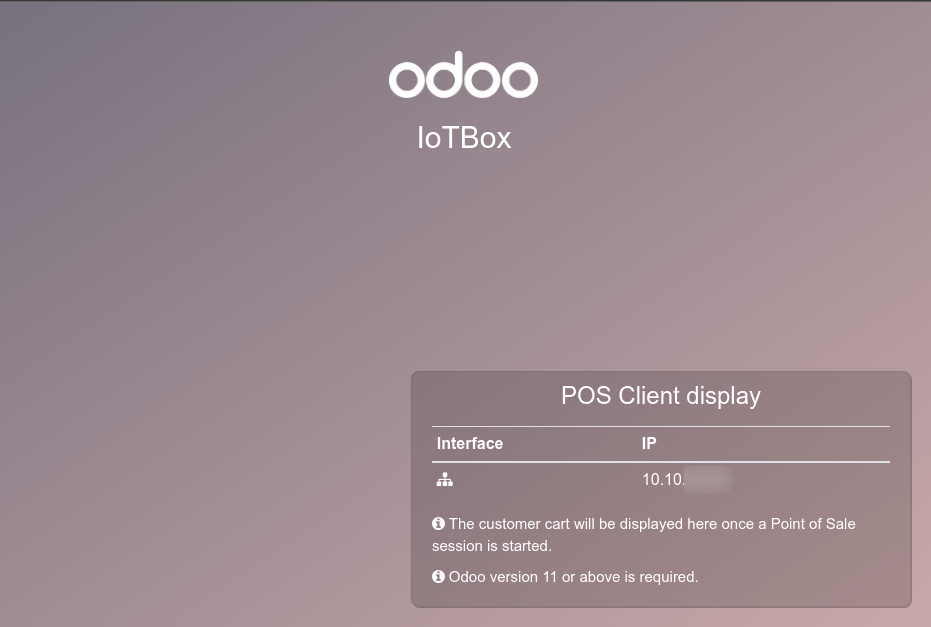
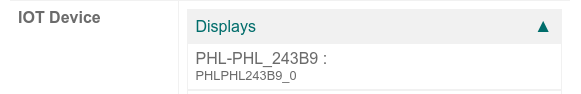

================
Connect a Screen
================

When using your *IoT Box* in Odoo, you could need to use a screen.
After being connected, it will allow you to display to your client the
current PoS order.

.. image:: screen/screen-pos-client-display.png
   :align: center

.. note::
        You can also access the Customer Display from any other computer by
        accessing the *IoT Box* homepage and clicking on the *POS Display* button.

.. note::
        Starting version 15. The usage of the *IoT Box* is no longer mandatory
        to display the PoS session. You can set in the PoS configuration
        to display the PoS session from any computer using the PoS.

Connection
==========

The way to connect the screen to the *IoT Box* differ depending on the model.

.. tabs::

   .. tab:: *IoT Box model 4*

        You can connect up to 2 screens with Micro-HDMI cables on the side of the *IoT Box*.
        If 2 screens are connected, they can display distinct content (see usage below).

   .. tab:: *IoT Box model 3*

        Connect the screen with a HDMI cable on the side of the *IoT Box*

.. important::
    Screen(s) should be connected before the *IoT Box* is switched on.
    If it is already on, connect the screen(s) then restart the *IoT Box*
    by unplugging and plug back its power source.

.. warning::
    The usage of HDMI/Micro-HDMI adapters may cause issue which will result on
    a black screen on the screen. Cable usage is recommended.

If the connection was successful, the screen should display the
"POS Client display" screen.

You should also see your screen in the list of Displays
on the *IoT Box* homepage.

.. note::
    If no screen is detected, a default display will be used named "Distant Display"

    .. image:: screen/screen-no-screen.png
       :align: center

Usage
=====
Show Point of Sales orders to customers
~~~~~~~~~~~~~~~~~~~~~~~~~~~~~~~~~~~~~~~

To use the screen in your *Point of Sale* app, go to :menuselection:`Point of Sale --> Configuration
--> Point of Sale`, open the one you want to configure, then click on *Edit* and enable the *IoT
Box Devices* feature.

Now, choose the *IoT Box* in the dropdown menu and choose the screen in *Customer Display* option.
Then, you hit save.

    .. image:: screen/screen-pos-screen-config.png
       :align: center

The screen is now be available in your PoS sessions. A "screen" icon will appear in the top bar to inform the
connection status with the screen.

    .. image:: screen/screen-pos-icon.png
       :align: center

The screen will automatically show the PoS orders and update when changes are performed on the order.

.. image:: screen/screen-pos-client-display.png
   :align: center

Display a website
~~~~~~~~~~~~~~~~~

Opening the screen form view at :menuselection:`IoT --> Devices --> (screen device)`
will allow you to choose a particular website URL to display on the screen with the
*Screen URL* field.